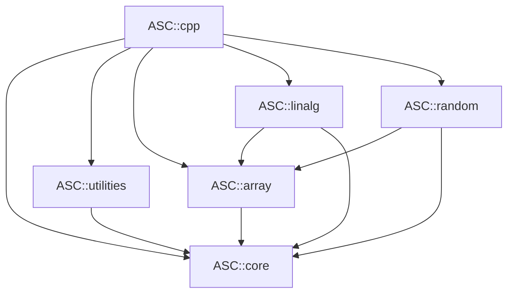
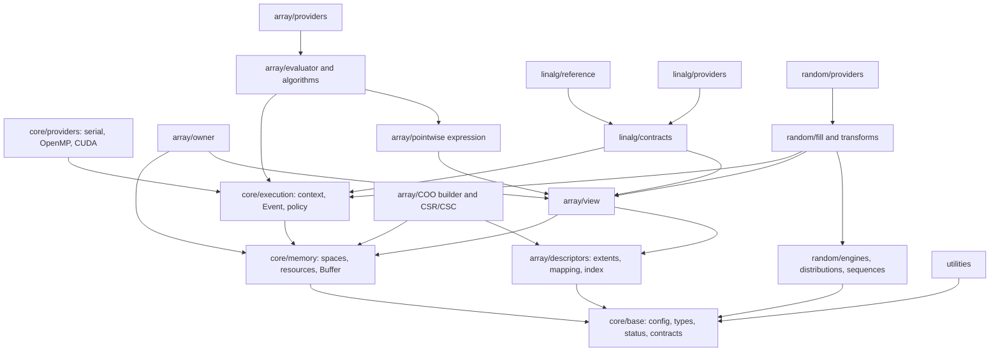

# asc-cpp Architecture Blueprint v1

**Status:** Approved; Phase III implementation authorized  
**Date:** 2026-07-22  
**Authority:** Lead Architect synthesis of Designer Agents A, B, and C  
**Companion analysis:** `docs/design/architecture_review_v1.md`

## 1. Purpose and decision status

This document is the normative architecture for the next asc-cpp design. It
compares the three required independent proposals, resolves their
conflicts, and defines the target modules, dependency graph, data model,
execution model, API policy, build structure, verification system, and staged
migration.

The words **must**, **must not**, **should**, and **may** express architectural
requirements. They are binding under the recorded architecture approval.

Approval was received before Phase III implementation. The frozen per-module
designs record the bounded milestone decisions used to implement this
blueprint; remaining Architecture Decision Records stay required before their
corresponding deferred scope is implemented.

## 2. Inputs and provenance

The synthesis is based on:

- `AGENTS.md`, `generator.md`, every current asc-cpp document, the complete
  production tree, CMake/package definitions, CI, examples, and tests;
- `docs/design/architecture_review_v1.md` and its verified default build,
  507-test GoogleTest inventory, and package-relocation result;
- the current MdeCpp reference at
  `/home/yicai/repo/MdeRepo/MdeCpp`, commit
  `f6294e9079262682ce63ae7ff2d8a643e658bf5d`;
- three independent architecture proposals produced for this review.

Provenance caveats:

- Most of the current asc-cpp working tree is untracked, so it is a filesystem
  baseline rather than a clean committed baseline.
- The local MdeCpp tree has a pre-existing modified `Makefile`.
- `generator.md` names an older MdeCpp audit revision. The current reference
  has changed substantially and must be cited explicitly.
- MdeCpp's ignored `legacy/`/MdeMat material and ignored `docs/std.md` are not
  reproducibly identified by the MdeCpp commit. They must not be accepted as
  golden provenance without a separate version identity.

## 3. The three proposals

### 3.1 Agent A — asc-cpp Historical Architect

Agent A views asc-cpp as a successful boundary and packaging extraction, not a
completed redesign.

Its proposal emphasizes:

- retaining the five public components, flat `asc` namespace, component CMake,
  package behavior, shape/layout/index decomposition, and characterization
  tests;
- evolutionary replacement behind bounded compatibility facades;
- avoiding gratuitous renaming and a clean-slate rewrite;
- replacing global/manual memory and execution internals;
- splitting owner/view, sparse assembly/storage, linalg operations, and random
  layers;
- preserving portable algorithms as reference behavior.

Primary advantage: lowest migration and downstream breakage risk.  
Primary limitation: historical continuity can preserve abstractions longer
than their semantics justify unless the compatibility window is strictly
bounded.

### 3.2 Agent B — MdeCpp Migration Expert

Agent B treats MdeCpp as evidence and mathematical provenance, not as the
target architecture.

Its proposal identifies reusable assets:

- shape, layout-map, index, and iterator semantics;
- dense/sparse behavior and tests;
- read/write access-intent vocabulary;
- portable algebra algorithms as reference kernels;
- scalar RNG algorithms, low-discrepancy sequences, and Sobol data.

It rejects:

- the monolithic target and global CMake policy;
- the documented but unenforced layer ordering;
- global `Device`/`MemoryManager`, non-RAII `Memory<T>`, owner/view fusion, and
  nominal concepts;
- monolithic algebra headers, duplicate solver policy, and mutable random
  singletons;
- migration of domain layers into asc-cpp.

Agent B found that MdeCpp's monolithic target hides actual dependency
violations: `random -> algebra`, and an internal `core -> device -> core` include
cycle. It recommends preserving `random -> linalg` while the current correlated
sampler API remains.

Primary advantage: strongest file-level evidence and migration-risk analysis.  
Primary limitation: if treated as the permanent graph, its transitional
`random -> linalg` decision retains a broad dependency that the target API can
remove through explicit composition.

### 3.3 Agent C — Independent Scientific Computing Architect

Agent C proposes asc-cpp as a compact local scientific data plane, deliberately
not a replacement for Kokkos, PETSc, PyTorch, or an experiment framework.

Its proposal emphasizes:

- single-space RAII storage and explicit data movement;
- distinct owners and views with transitive constness;
- explicit execution contexts, streams/events, capabilities, and deterministic
  fallback policy;
- hybrid dispatch: runtime once per coarse operation, compile time within hot
  kernels;
- structural concepts, 64-bit indices, mixed extents, and scalar customization;
- narrow linalg contracts with reference and compiled providers;
- key/counter-based random filling;
- distributed, AD, AI, and RL interoperability boundaries rather than native
  scope.

Primary advantage: clearest long-term CPU/GPU, concurrency, AD-interoperability,
and performance model.  
Primary limitation: it creates the highest implementation and source-migration
risk if introduced as a simultaneous rewrite.

## 4. Proposal comparison and lead resolutions

| Topic | Agent A | Agent B | Agent C | Lead resolution |
|---|---|---|---|---|
| Overall strategy | Evolutionary redesign | Evidence-based migration | Clean target model, staged adoption | Adopt C's target through A/B's staged compatibility migration |
| Public modules | Preserve five | Preserve five | Preserve five | Preserve exactly five plus `ASC::cpp` |
| Namespace | Flat `asc` | Flat `asc` | Flat `asc` | Flat `asc`; only `asc::detail` is non-public implementation |
| MdeCpp reuse | Semantics and tests | Explicit reuse/discard inventory | Do not let legacy define target | Reuse mathematical behavior and tests, not runtime/build mechanisms |
| Memory | RAII, explicit space | Replace current system | Single-space move-only buffer | Single-space move-only RAII `Buffer`; mirrored memory is temporary compatibility only |
| Execution | Explicit context | Explicit context/resources | Context plus event and hybrid dispatch | Explicit context/event; coarse runtime dispatch and static kernel bodies |
| Array naming | Avoid broad renaming | Replace unsafe roles | Canonical owner/view roles | Add canonical role-specific types; retain familiar aliases only as bounded facades |
| Mixed extents | Measure before adoption | Decide explicitly | Support | Target supports mixed static/dynamic extents; implementation requires compile-cost validation |
| Sparse scope | Honest supported ranks | Matrix-oriented formats | Rank-two finalized formats | COO builder plus finalized rank-two CSR/CSC; no rank-N compressed claim |
| Linalg | Narrow contracts/providers | Reference kernels plus providers | Hybrid reference/compiled providers | Adopt all three; common API independent of enabled providers |
| Random dependency | Remove linalg after API migration | Keep while current API remains | Remove through explicit factor composition | Transitional edge remains; target graph has `random -> core,array`, not linalg |
| Copy semantics | Explicit ownership, compatibility | Replace owner/view fusion | Move-only owner, explicit clone | Canonical owners are move-only; deep copy is explicit; legacy facade may preserve documented copying temporarily |
| Backend plugins | Isolate providers | Component-scoped providers | Private compiled-in SPI first | Compiled-in private providers for v1; no binary plugin ABI yet |
| Kokkos/Eigen/PETSc | Optional adapters | Backend/reference inputs | Borrow patterns, no mandatory type system | No mandatory ecosystem dependency or common-header type leakage |
| Distributed support | Adapter/higher layer | Do not migrate domain layers | Explicit maps belong above local tensors | Local interop hooks only; no MPI/distributed tensor in the five modules |
| AD | Scalar customization first | Do not inherit legacy restrictions | Scalar-generic reference path | Forward/custom scalar interoperability first; no native tape |
| Migration | Compatibility releases | Pin provenance and test defects | Guardrails then staged adoption | Characterize, replace bottom-up, remove facades at a declared pre-1.0 break |

### 4.1 Consensus adopted without modification

All three proposals agree that asc-cpp must:

- remain domain-neutral and keep the repository-family dependency direction;
- keep the five public components and flat namespace;
- preserve useful shape/layout/index ideas and reference algorithms;
- replace manual memory ownership and mutable process-global correctness;
- separate owner, view, memory space, and execution;
- use 64-bit public indexing;
- isolate optional backends and keep a CPU reference path;
- make linalg API capability stable across installations;
- design random state for reproducibility and concurrency;
- use characterization and architecture tests before semantic replacement;
- keep native distribution, autograd, and experiment/RL systems out of scope.

### 4.2 Rejected alternatives

The Lead Architect rejects:

- a wholesale rewrite landed in one change;
- indefinite compatibility facades or two permanent container hierarchies;
- global device, allocator, pointer-registry, or mutable provider selection as a
  correctness mechanism;
- implicit host/device migration or silent cross-backend fallback;
- an all-header-only library;
- virtual dispatch per element;
- a universal runtime-rank/type-erased tensor in ordinary numerical kernels;
- a lazy graph spanning linalg, communication, and random operations;
- mandatory Kokkos, Eigen, PETSc, CUDA, or another third-party type system;
- a public binary backend plugin ABI in the first redesign;
- retaining `random -> linalg` by duplicating linalg operations inside random;
- module namespaces such as `asc::array` or a compatibility `mdecpp` namespace;
- native MPI distribution, reverse-mode autograd, training loops, experiment
  databases, or RL environments inside asc-cpp.

## 5. Architectural mission and boundaries

asc-cpp is the local, domain-neutral computational foundation of AI4SciComp.

```text
asc-cmake <- asc-cpp <- asc-xde <- asc-kinetic <- asc-lab
```

An arrow means “depends on.” Dependencies must never point from asc-cpp toward
the higher repositories.

asc-cpp owns:

- scalar/index contracts, errors, memory resources, and execution contexts;
- local dense and sparse array descriptors, owners, views, and pointwise
  evaluation;
- domain-neutral linear algebra and numerical providers;
- general random engines, sequences, distributions, and bulk filling;
- small reusable configuration, CLI, timing, and diagnostic utilities.

asc-cpp does not own:

- geometry, basis systems, function/operator domain hierarchies, meshes, FEM,
  quadrature, ODE/PDE schemes, or physical distributions;
- communicator ownership, global maps, ghost exchanges, or distributed
  matrices;
- a reverse-mode tape or graph compiler;
- Python bindings, models, optimizers, experiment tracking, workflow engines,
  training loops, or RL environments.

## 6. Stable public modules and dependency graph

### 6.1 Component responsibilities

| Target | Target form | Responsibility | Must not own |
|---|---|---|---|
| `ASC::core` | compiled plus templates | types, status/contracts, memory spaces/resources, buffer, execution context/event, serial runtime | arrays, linalg kernels, random algorithms, domain abstractions |
| `ASC::utilities` | compiled | config, CLI, timer, narrow diagnostics/tracing | backend runtime, numerical arrays, experiment orchestration |
| `ASC::array` | compiled plus templates | extents, mappings, owners/views, expressions, broadcasting, reductions, sparse storage, array kernels | factorization/solver policy, RNG state, domain semantics |
| `ASC::linalg` | compiled plus templates | BLAS operations, contractions, factorizations, dense/sparse solvers, numerical providers | random generation, domain operators, global execution policy |
| `ASC::random` | compiled plus templates | engines, distributions, quasi-random sequences, deterministic bulk fill and transforms | covariance factorization, solver policy, experiment seeding policy |
| `ASC::cpp` | interface aggregate | convenience link/include aggregation | implementation or new API ownership |

`ASC::linalg` becomes a real compiled component for common scalar kernels and
provider bindings while retaining header-visible generic reference kernels.

### 6.2 Target dependency DAG

Here `A --> B` means “A directly depends on B.” Direct core edges are shown
where public headers name core types, even if another path is transitive.



The graph is acyclic. Public headers must not introduce undeclared direct
dependencies.

### 6.3 Transitional graph

Until the covariance-accepting `NormalSampler` compatibility API is replaced,
the implementation retains:

```text
ASC::random -> ASC::linalg -> ASC::array -> ASC::core
```

The edge may be removed only when:

- covariance factorization is performed by linalg;
- random accepts a validated precomputed transform;
- transform application uses array-level operations without hidden linalg;
- compatibility and downstream migration tests pass.

### 6.4 Namespace and header policy

- Stable public declarations live directly in `namespace asc`.
- `asc::detail` is the only sanctioned implementation namespace and is not API.
- Each component has one stable umbrella header and narrow feature headers.
- `<asc/cpp.h>` aggregates the five component umbrellas.
- `<asc/asc.h>` remains a compatibility convenience include.
- Production code should include the narrowest owning header.
- Installed `detail/` headers are allowed only where template visibility
  requires them; consumers never include them directly.
- Common umbrellas must not conditionally expose different APIs when a provider
  is enabled.

## 7. Internal architecture

### 7.1 Conceptual dependency DAG



Provider code depends on stable lower contracts. Contracts must not include or
depend on providers. Internal implementation targets are unexported and do not
form a second public module system.

### 7.2 Target repository layout

The exact file split may evolve through ADRs, but ownership must follow this
shape:

```text
include/asc/
  core.h
  core/
    config.h
    types.h
    scalar_traits.h
    status.h
    contracts.h
    portability.h
    memory_space.h
    memory_resource.h
    buffer.h
    execution_context.h
    event.h
    detail/...
  utilities.h
  utilities/
    config.h
    cli.h
    timer.h
    diagnostics.h
    detail/...
  array.h
  array/
    extents.h
    layout.h
    index.h
    tensor_view.h
    tensor.h
    concepts.h
    expression.h
    algorithms.h
    sparse_builder.h
    sparse_matrix.h
    adapters/...
    detail/...
  linalg.h
  linalg/
    types.h
    blas1.h
    blas2.h
    blas3.h
    tensor_contract.h
    factorization.h
    solver.h
    sparse.h
    adapters/...
    detail/...
  random.h
  random/
    engine.h
    counter_engine.h
    distribution.h
    sequence.h
    fill.h
    transform.h
    detail/...
  cpp.h
  asc.h

src/
  core/
    runtime/
    providers/{serial,openmp,cuda}/
  utilities/
  array/
    kernels/{reference,openmp,cuda}/
  linalg/
    kernels/{reference,blas_lapack,cuda}/
    adapters/eigen/
  random/
    tables/
    kernels/{reference,openmp,cuda}/

tests/
  core/
  utilities/
  array/
  linalg/
  random/
  conformance/
  compile/
  package/
  interop/

benchmarks/
  array/
  linalg/
  random/
  transfer/
  compile_time/

docs/
  design/
    architecture_blueprint_v1.md
    adr/...
  modules/...
  backends/...
  migration/...
```

## 8. Core contracts

### 8.1 Fundamental types and scalar customization

- Public extents, strides, offsets, counts, and sparse indices use signed
  64-bit aliases such as `index_t`, `extent_t`, `stride_t`, and `nnz_t`.
- Byte calculations use checked unsigned arithmetic.
- Narrowing to backend/vendor integer types is checked before dispatch.
- `real_t` remains a convenience default, not the scalar contract of generic
  algorithms or solver tolerances.
- `DefaultLayout` is fixed by the public library contract, initially
  column-major `LayoutLeft`; downstream macros must not change public aliases or
  ODR-visible semantics.
- Scalar customization describes value/real/accumulation types, zero/one,
  mathematical operations, tolerances, and device-transfer eligibility.
- Host reference arrays may support valid non-trivial scalar types. Device
  kernels require a separate device-copyable/device-operable contract.
- Initial compiled numerical types should be float, double, and complex where
  the operation is mathematically defined. Custom/AD scalars use generic
  reference paths and do not imply vendor-provider support.

### 8.2 Status, contracts, and diagnostics

- Shape, rank, range, layout, and alias preconditions at public operation
  boundaries remain active in release builds.
- Debug assertions cover internal invariants only.
- Recoverable allocation, backend, factorization, and solver failures use a
  stable `Status`/`Result` model with an ASC code and optional provider detail.
- Exceptions may be convenience translation, not the only recoverable error
  channel and not a compile-time change to common operation availability.
- Element-level unchecked access remains zero-overhead; a distinct checked
  accessor must be available.
- Diagnostics use an injectable or context-scoped sink. Mutable global streams
  and error actions are compatibility-only.

### 8.3 Memory resources and buffer ownership

The canonical storage model is one allocation in one explicit memory space.

- `Buffer<T>` owns storage through RAII and is move-only.
- Deep copy is explicit through clone/copy operations.
- Buffer destruction uses a resource handle whose lifetime is guaranteed
  independently of the creating context.
- Host, pinned host, device, unified/managed, and externally managed memory are
  distinct spaces/resources.
- Unified memory is explicit; it is not described as ordinary host memory.
- No implicit raw-pointer conversion exists.
- Host pointers are obtainable only for host-addressable spaces.
- Device pointers are consumed only by a compatible provider/kernel path.
- Copy and fill operations state source/destination spaces and context.
- Basic storage does not carry an execution preference.
- Hidden host/device migration and silent fallback are forbidden.

An internal allocation control block may retain a resource/deleter for
asynchronous or external ownership. That must not turn ordinary tensor copying
into silent shared aliasing.

The current mirrored-memory access-intent API may be implemented temporarily
by a compatibility object with allocation-local state. It must not use a
process-global pointer registry in the target architecture.

### 8.4 Execution context and events

`ExecutionContext` is an explicit, cheap runtime handle for:

- backend kind and device identifier;
- queue/stream;
- memory resources;
- provider/library handles;
- capabilities and deterministic/fallback policy;
- diagnostic sink.

Rules:

- Contexts are independently constructible and concurrently usable.
- No mutable process-global context is a source of correctness.
- A thread-local default context may support convenience overloads during and
  after migration, but every such overload is semantically equivalent to
  passing that context explicitly.
- Coarse operations dispatch once through the context.
- Hot kernel loops use compile-time policies/static dispatch.
- Synchronous operations wait before returning.
- Explicit asynchronous operations return an `Event`.
- Input/output storage and views must remain valid until their event completes;
  this lifetime rule is part of the API contract.
- Provider selection and fallback are deterministic and queryable.
- Unsupported capability fails before acquiring or dereferencing an
  incompatible pointer.
- Fallback never performs an implicit transfer. A caller may request an
  explicit transfer-and-fallback policy at a higher orchestration layer.

User-authored CUDA kernels require an explicit CUDA-compiled extension header
or approved adapter. Ordinary C++ consumers invoke compiled operations without
parsing CUDA headers.

## 9. Array contracts

### 9.1 Descriptor model

The canonical model separates metadata from allocation:

```text
Extents + LayoutMapping + Accessor = tensor descriptor/view
Buffer + tensor descriptor         = owning tensor
```

- Rank is compile-time in the primary C++ API.
- Extents may mix static and dynamic dimensions.
- Mappings support column-major, row-major, and arbitrary non-negative strides.
- Layout and memory space are orthogonal.
- One shape algebra owns reshape, slice, permutation, broadcasting,
  result-shape inference, and compatibility validation.
- Broadcasting follows documented trailing-axis rules independent of physical
  layout.
- A runtime-rank/type-erased descriptor is restricted to dispatch and
  interoperability boundaries.

### 9.2 Owners and views

- The canonical owning tensor is move-only.
- Deep copying is explicit and accepts an execution context/destination space.
- Mutable and const-element views are distinct types.
- A const owner produces only a const-element view.
- Views are non-owning and lightweight; the owner-outlives-view rule is
  explicit.
- Kernel arguments are views, not owners, memory managers, or global state.
- Slice, transpose, permutation, and reshape produce views when representable;
  otherwise an explicitly named materialization operation is required.
- No owner/view decision is encoded through mutable ownership flags.
- Ordinary iteration and element access do not silently synchronize or migrate
  memory.

Canonical successor names may be `Tensor` and `TensorView`; exact spelling is
confirmed by the array API ADR. Existing `DenseMArray`, `MShape`, and familiar
vector/matrix aliases may forward during migration. A facade must not preserve
the ability to mutate a const source through a view.

### 9.3 Concepts and expressions

- Concepts are structural and operation-specific.
- Vector and matrix concepts require exact ranks one and two.
- Readability, writability, contiguity, striding, memory accessibility, scalar
  capability, and sparse/dense storage are distinct requirements.
- Third-party adapters do not need to inherit from ASC types.
- Pointwise expressions carry shape and scalar metadata.
- Expression terminals borrow lvalue views; expressions from temporary owning
  tensors are rejected unless lifetime is made explicit.
- Pointwise nodes may fuse; products, factorizations, communication, and random
  generation are coarse operations, not general lazy nodes.
- Evaluation validates shape and aliasing, chooses materialization when needed,
  and dispatches with an execution context.

### 9.4 Sparse model

- The initial finalized sparse contract is rank-two matrices only.
- A mutable COO builder accepts unordered entries and duplicates.
- Finalization validates indices, sorts, and coalesces according to a documented
  duplicate policy.
- Finalized CSR/CSC storage has immutable structural arrays and separately
  mutable values.
- Format conversion is explicit.
- Routine arithmetic must not hide a conversion through COO.
- Sparse scalar/vector aliases and rank-N compressed claims are removed or
  deprecated.
- Distributed sparse matrices are external adapters/higher-layer types.

## 10. Linalg contracts

Elementwise transcendental/logical functions, broadcasting, and general
reductions belong to array. Linalg owns:

- BLAS1, BLAS2, and BLAS3 operations;
- tensor contractions;
- factorizations;
- dense and sparse solvers;
- matrix-free, domain-neutral action concepts;
- numerical provider adapters.

Every common operation must define:

1. exact rank, scalar, layout, alias, and shape constraints;
2. release-active validation;
3. an always-available serial reference path when mathematically supported;
4. a deterministic provider selection rule;
5. explicit fallback and transfer behavior;
6. stable status and numerical-failure semantics;
7. documented accuracy, determinism, and workspace behavior.

Factorizations are reusable value-like handles containing pivots, workspace,
provider state, and diagnostics. Repeated solves reuse the factorization.
Property-based automatic solver selection may accept explicit user hints; it
must not repeatedly infer expensive properties without a stated policy.

The common API exists regardless of Eigen, BLAS/LAPACK, MKL, or CUDA enablement.
Providers accelerate supported combinations; unsupported combinations report a
capability result. No provider may silently move arrays or choose a different
mathematical operation.

Generic/custom-scalar reference kernels remain header-visible. Common
float/double/complex kernels, provider bindings, and large solver machinery are
compiled. Third-party native types appear only in explicit adapter headers.

## 11. Random contracts

Random is organized as:

```text
engines -> distributions and quasi-random sequences -> bulk fill/transforms
```

- Stateful scalar engines are ordinary caller-owned values.
- Counter/key-based engines support deterministic parallel bulk generation.
- Entropy seeding is explicit opt-in.
- Seed, key, counter, stream, subsequence, skip, reset, and serialization
  semantics are documented per named algorithm.
- Tests/examples use explicit deterministic state.
- Mutable global prime/permutation caches are forbidden.
- Sobol direction tables are shared immutable compiled data.
- Bulk fill accepts an execution context, destination view, distribution,
  logical key/counter, and logical offset.
- A documented deterministic mode defines partition/backend guarantees.
- Bitwise guarantees apply only to explicitly named algorithms and transforms;
  unspecified provider transcendental implementations are not assumed equal.
- Sampling uses the destination's actual descriptor/layout, never a
  build-global layout branch.
- The sampler base is non-polymorphic unless a real runtime interface is
  approved.

Covariance factorization belongs to linalg. The target random API accepts a
validated precomputed factor/transform and applies it using array-level
operations. A covariance-taking facade may exist during migration but is not
part of the final dependency architecture.

## 12. Utilities contracts

- Utilities depend only on stable core base interfaces.
- Timer operations define safe empty-state behavior and distinguish last,
  total, and average measurements.
- CLI parsing accepts negative numeric values, reports unknown positional
  arguments, and has no fixed unbounded-write buffer.
- Configuration supports validation and canonical serialization using standard
  containers.
- Diagnostics and optional tracing use injected sinks.
- Utilities do not own numerical arrays, backend selection, workflow
  scheduling, experiment tracking, or persistent result databases.

## 13. Backend, template, and ABI policy

### 13.1 Header versus compiled boundary

Header-visible/template code:

- extents, mappings, descriptors, views, and structural concepts;
- small pointwise expressions;
- scalar-generic reference kernels;
- compile-time user-kernel policies;
- thin common operation facades.

Compiled code:

- resources, contexts, events, provider state, and error translation;
- allocation/copy/fill runtime operations;
- standard-scalar array/linalg/random kernels;
- OpenMP/CUDA and BLAS/LAPACK bindings;
- factorization/solver state;
- Sobol and other large immutable tables;
- non-template utilities.

Dynamic polymorphism/type erasure is permitted at memory-resource, context,
provider, factorization, and interoperability boundaries. It is forbidden per
element.

### 13.2 Provider policy

- Serial reference providers are always present.
- OpenMP, CUDA, BLAS/LAPACK, Eigen, and MKL providers are independently
  selectable where meaningful.
- The initial provider SPI is private, version-internal, and compiled in.
- Provider registration is immutable after context construction or explicitly
  synchronized; no mutable process-global provider registry is allowed.
- CUDA sources are limited to CUDA providers and explicit user-kernel tests.
- cuBLAS/cuSPARSE belong to linalg providers, not core.
- Common headers do not include backend SDK headers.
- Optional packages do not add/remove common API declarations.
- A binary plugin ABI is deferred until a concrete deployment need and a
  versioned C-compatible design exist.

### 13.3 ABI and configuration

- Public aliases, layout defaults, precision-independent contracts, and feature
  macros have one installed-package meaning.
- Package-wide `real_t` precision is an explicit ABI dimension but does not
  restrict templated scalar types.
- Backend availability is capability metadata, not public type identity.
- Symbol visibility is explicit for all supported shared builds.
- Config/package files expose requested components and necessary static-link
  dependencies without leaking unrelated compile flags.
- ABI/API compatibility is measured before a stable 1.0 promise.

## 14. Build, test, and documentation architecture

### 14.1 Build and packaging

- Retain component-owned CMake files, explicit source/header manifests,
  `asc-cmake`, aliases, components, and relocation tests.
- Internal provider/object targets are not installed as public components.
- Every public header dependency has a matching declared target dependency.
- Optional dependency discovery is scoped to the component/provider that uses
  it.
- Enabling CUDA must not change every source or consumer translation unit to
  CUDA.
- Build and installed-tree consumers must behave equivalently.
- Static/shared, single/double, strict, and supported provider combinations are
  tested through installed consumers.

### 14.2 Verification layers

1. **Characterization:** migrated MdeCpp behavior, known sequence prefixes,
   numerical reference kernels, and explicit records of accidental behavior.
2. **Unit:** focused component behavior and failure paths.
3. **Contract/property:** shape algebra, layout independence, mathematical
   identities, factorization residuals, sparse invariants, random properties.
4. **Architecture/compile:** minimal component links, forbidden dependencies,
   self-contained headers, negative concept/constness cases, representative
   multi-TU ODR cases.
5. **Backend conformance:** the same operation suite across serial, OpenMP,
   CUDA, and numerical providers, including execution-provider and memory-space
   assertions.
6. **Safety/concurrency:** sanitizer, failure injection, ownership, context
   independence, thread-safe immutable state, event lifetime.
7. **Package/interop:** build-tree/install-tree, components, relocation,
   static/shared, external/custom scalar and managed-memory ownership.
8. **Performance:** allocations, transfers, asymptotic sanity, compile time, and
   representative kernels against a recorded baseline.

Tests should be grouped by coherent submodule rather than three giant binaries
or one CTest per individual assertion. Header tests link the minimal owning
component. Performance gates use relative/regression thresholds appropriate to
their environment.

### 14.3 Documentation set

The maintained architecture set must include:

- this blueprint;
- ADRs for irreversible choices;
- one user and extension guide per component;
- memory/execution/context and asynchronous-lifetime contracts;
- shape, layout, broadcasting, sparse, and scalar semantics;
- backend capability and determinism matrix;
- package/consumer guide;
- API compatibility and deprecation table;
- file-granular MdeCpp provenance/handoff with exact revisions;
- performance methodology and supported-platform matrix.

Documentation claims must be verified by tests or explicitly marked as planned.

## 15. Future integration boundaries

### 15.1 Distributed computing

asc-cpp supplies 64-bit local indices, local views, explicit contexts, and
coarse operations. Communicators, ownership maps, global/local translation,
ghost state, collectives, and distributed matrices belong in a higher
component/repository. PETSc, Tpetra, and deal.II adapters should be prototyped
outside the local tensor model before any native distributed proposal.

### 15.2 Automatic differentiation

The first target is scalar interoperability:

- customizable scalar traits and math;
- host storage for valid non-trivial scalar types;
- device-specific scalar constraints;
- pure, shape-stable operations and explicit mutation;
- tests using a small forward dual type and an external adapter.

A reverse-mode tape, operation graph, JVP/VJP registry, and autograd dispatcher
require a separate approved architecture above this foundation.

### 15.3 AI, Python, and data interchange

asc-cpp prepares for AI workflows through batched descriptors, deterministic
random, explicit streams/events, and managed external-memory contracts.
DLPack or Python adapters must be explicit adapter headers/packages with
lifetime, deleter, read-only, byte-offset, and stream semantics. They are not
included by common umbrellas and do not make Python a core dependency.

### 15.4 Experiments and reinforcement learning

Experiment databases, checkpoints, model/trainer state, environments,
trajectory buffers, policies, and reinforcement-learning optimization belong
to `asc-lab`. Utilities may provide canonical configuration and timing hooks,
but not an orchestration platform.

## 16. Migration roadmap and approval gates

Each phase is independently reviewed, keeps the tree buildable, preserves an
acyclic graph, and adds tests before replacing behavior.

### Phase 0 — Approve and pin

- Approve this blueprint and its explicit open ADRs.
- Establish a clean committed asc-cpp baseline.
- Pin current MdeCpp and any MdeMat golden-data provenance independently.
- Freeze current public-header, target, behavior, numerical, compile-time, and
  performance manifests.
- Expand migration/handoff records to file, dependency, defect, tests,
  destination, and next action.

Gate: no unresolved ownership, copy, index, execution, dependency, or
compatibility decision.

### Phase 1 — Architecture guardrails

- Split core, utilities, and array tests into minimal-target groups.
- Generate self-containment tests from public file sets.
- Add forbidden-dependency and negative compile tests.
- Add release-contract, view constness, template-instantiation, arbitrary-layout,
  memory, concurrency, and backend-execution characterization.
- Establish sanitizer, portability, compile-time, allocation/transfer, and
  numerical baselines.

Gate: current defects are reproducible or explicitly characterized; a boundary
violation fails CI.

### Phase 2 — Core foundation

- Introduce fundamental type/scalar/status/contracts layers.
- Introduce memory spaces/resources, RAII buffer, context, event, and serial
  provider.
- Adapt legacy `Memory`, `Device`, `mm`, access-intent, stream, and error APIs
  temporarily.
- Remove the internal core/device include cycle.
- Isolate OpenMP/CUDA sources and common headers.

Gate: no manual deletion in new primitives; independent concurrent contexts
are testable; core-only consumers need no optional SDK header.

### Phase 3 — Array transition

- Introduce descriptors, mixed extents, typed const/mutable views, and owner.
- Migrate `UArray`, dense storage, view operations, then expressions.
- Centralize shape/broadcast/alias logic.
- Split COO assembly from finalized CSR/CSC matrices.
- Add legacy facades without preserving unsafe const mutation.

Gate: owner/view/copy/lifetime rules are enforced; every layout follows the
same mathematical semantics; large metadata values pass without allocation.

### Phase 4 — Linalg transition

- Move pointwise/broadcast operations to array.
- Split linalg operation contracts and retain corrected reference kernels.
- Add reusable factorization objects and structured failure behavior.
- Add BLAS/LAPACK, Eigen, and CUDA providers independently.
- Remove duplicate solver hierarchies and unused core CUDA linalg links.

Gate: provider conformance passes against reference behavior; unsupported
capability fails before access; common API is provider-independent.

### Phase 5 — Random and utilities transition

- Split engines, distributions, sequences, bulk fills, and transforms.
- Define seed/key/counter/subsequence and determinism contracts.
- Replace mutable caches and per-instance static data.
- Move covariance factorization to linalg and remove the final random-linalg
  dependency.
- Correct utility invariants and documentation.

Gate: scalar and bulk random behavior is reproducible as documented; target DAG
has no random-linalg edge; utilities remain lightweight.

### Phase 6 — Provider and package hardening

- Exercise serial/OpenMP/CUDA and numerical providers through the same suite.
- Test installed minimal components across static/shared and supported scalar
  configurations.
- Add capability queries, symbol/API/ABI checks, interop ownership tests, and
  performance/compile-time regression monitoring.

Gate: unrelated components remain SDK-independent; build/install behavior and
capability reporting are consistent.

### Phase 7 — Downstream integration

- Migrate asc-xde and asc-kinetic consumers through compatibility facades.
- Prototype custom forward AD and managed-memory/DLPack-style adapters.
- Prototype distributed adapters outside the local tensor ownership model.
- Update examples, module guides, and migration tables.

Gate: known downstream consumers no longer require deprecated unsafe behavior.

### Phase 8 — Breaking cleanup before 1.0

- Remove global/manual memory correctness, mutable const views, broad forwarding
  headers, unsupported sparse aliases, and obsolete solver/sampler hierarchies.
- Remove temporary mirrored-memory and covariance-taking compatibility paths if
  no longer required.
- Finalize visibility, capability, deprecation, performance, and support
  policies.

Gate: one canonical implementation hierarchy remains and the stable public DAG
matches Section 6.

## 17. Required Architecture Decision Records

Before Phase 1 implementation, approve ADRs for:

1. public index/extent/stride widths and vendor narrowing;
2. canonical owner copy/move/clone semantics;
3. view lifetime and constness;
4. memory spaces, explicit transfer, and temporary mirror compatibility;
5. execution context, event lifetime, default context, and fallback policy;
6. status/result and exception translation;
7. shape algebra, mixed extents, broadcasting, and layout default;
8. scalar customization and initial compiled scalar set;
9. sparse supported ranks, builder/finalized invariants, and duplicate policy;
10. provider selection, capability discovery, determinism, and private SPI;
11. random seed/key/counter/reproducibility and random-linalg separation;
12. public successor names, compatibility window, and pre-1.0 removal policy.

## 18. Approval decision

Approval of this blueprint means approval of these core choices:

1. Preserve the five components, flat `asc`, repository boundary, useful
   shape/layout semantics, reference kernels, and component packaging.
2. Replace the current runtime center with explicit single-space RAII storage,
   typed views, contexts/events, and coarse provider dispatch.
3. Adopt move-only canonical owners, explicit deep copy, release-active public
   contracts, and 64-bit metadata.
4. Use a hybrid template/compiled architecture with no provider SDK in common
   headers and no implicit transfer/fallback.
5. Narrow sparse and linalg contracts to behavior the implementation can
   honestly support.
6. Redesign random for deterministic parallel composition and remove its final
   linalg dependency after the compatibility migration.
7. Support distributed computing, AD, and AI through local protocols and
   adapters first; keep native higher-level systems outside asc-cpp.
8. Perform an evolutionary, test-gated migration and remove compatibility
   facades at a declared breaking release before 1.0.

Explicit approval was received before Phase III implementation began. Further
milestones remain subject to their module design and review gates.
