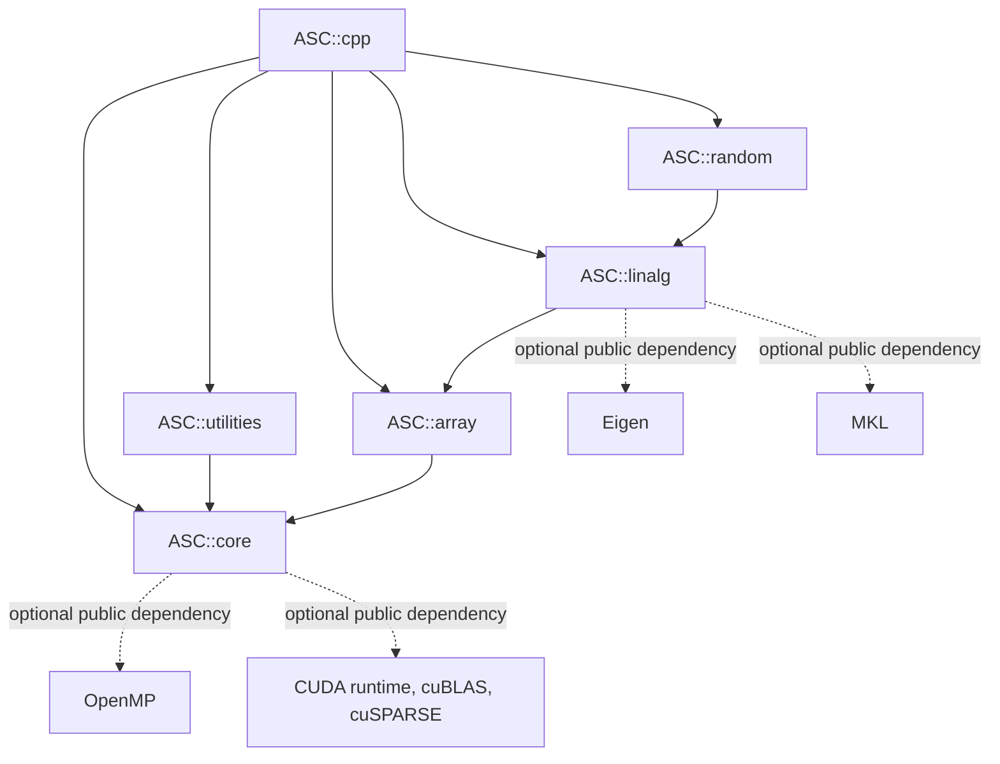
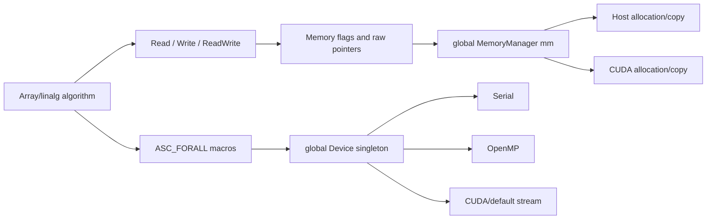
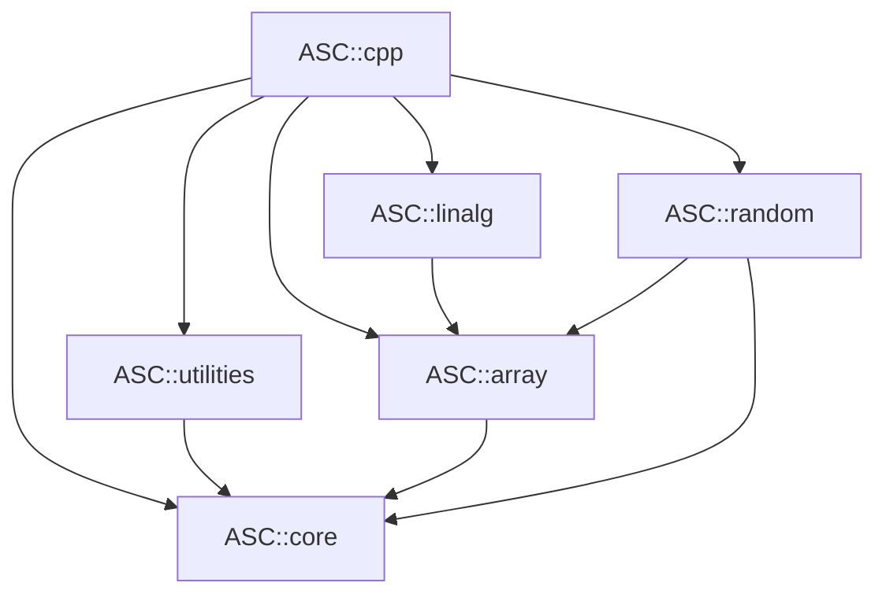
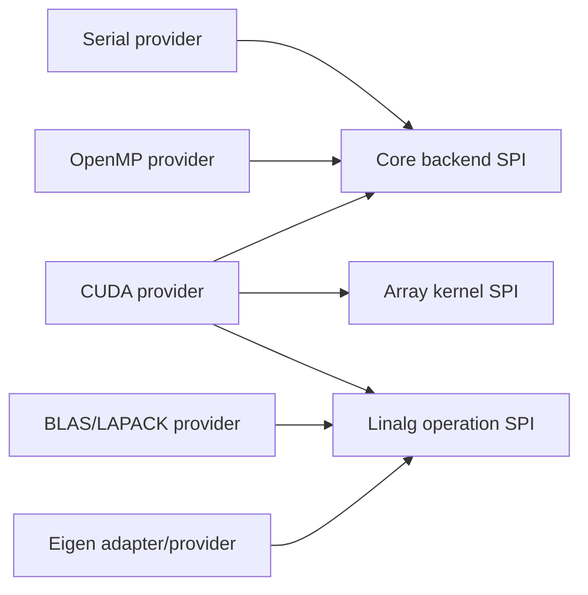
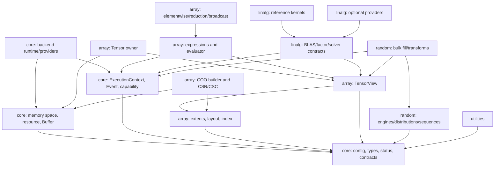

# asc-cpp Architecture Review v1

> **Superseded historical document.** This file describes the deleted implementation at historical HEAD `33b261ea33616a6395c4ad3b20646093103344f7`; it is retained only for auditability and is not current API, build, package, or implementation guidance. See the [approved Stage A six-module blueprint](../development/asc-cpp-architecture/architecture-blueprint.md).

**Status:** Approved; Phase III implementation authorized  
**Date:** 2026-07-22  
**Scope:** The current `asc-cpp` working tree, its build and package system,
the migration contract, all repository documentation, and the current local
MdeCpp reference tree

## 1. Executive decision

The repository has the right product boundary and a credible first migration
baseline, but its internal architecture is not yet suitable as the long-lived
foundation for multi-backend scientific computing.

The following parts should be retained:

- exactly five public production components: `core`, `utilities`, `array`,
  `linalg`, and `random`, plus the `ASC::cpp` convenience aggregate;
- the flat public `asc` namespace;
- the repository boundary that excludes geometry, discretization, physics,
  solvers tied to a domain, experiments, and applications;
- the separation of shape, layout mapping, indexing, storage, and traversal;
- the portable numerical kernels and migrated tests as characterization
  references;
- component targets, explicit installed headers, package components, and
  relocation tests.

The following parts should be replaced incrementally behind compatibility
facades:

- global `Device` and `MemoryManager` state;
- non-RAII `Memory<T>` ownership and the global pointer registry;
- the fusion of owning arrays, aliases/views, memory synchronization, and
  execution preference;
- nominal ASC-only concepts and 32-bit sizes;
- common headers that expose CUDA or optional numerical backends;
- monolithic linalg and random interfaces;
- implicit backend selection and operations whose behavior/API changes with
  build-time optional dependencies.

The recommended architectural center is:

1. a move-only RAII `Buffer` allocated in one explicit memory space;
2. distinct mutable and const tensor views;
3. an explicit `ExecutionContext` carrying backend, device, queue/stream,
   allocator, and capability state;
4. shape-aware array expressions evaluated through operation-level dispatch;
5. narrow, stable public APIs with reference kernels and isolated optional
   backend providers.

The user approved the decisions in Section 9 before Phase III implementation.
Each module remains governed by its frozen module design and completion gate.

## 2. Review basis and verification

### 2.1 Material inspected

This review covered:

- `AGENTS.md` in full, including its required three-view architecture process;
- `generator.md` in full;
- every document under `docs/`;
- all production headers and source files under `include/asc/` and `src/`;
- root and component CMake files, package configuration, presets, CI, examples,
  and test composition;
- test source organization and representative tests for every component;
- the current local MdeCpp tree at
  `/home/yicai/repo/MdeRepo/MdeCpp`, revision
  `f6294e9079262682ce63ae7ff2d8a643e658bf5d`;
- the relevant public ownership boundary of the sibling `asc-cmake` project.

Three independent viewpoints were reconciled as required by `AGENTS.md`:

- a historical review of the migration contract, docs, and current tree;
- a migration review against current MdeCpp;
- an independent scientific-computing design review informed by Eigen, Kokkos,
  MFEM, PETSc, Trilinos/Tpetra, deal.II, NumPy, PyTorch, and Julia patterns.

### 2.2 Verified baseline

The reviewed tree contains 52 installed public headers, 14 C++ implementation
files, and 17 test/consumer C++ files. The public implementation is strongly
template-oriented: several implementation headers are installed, while
`blas.h` and `lapack.h` alone are approximately 1,900 and 1,600 lines.

The following fresh default pipeline passed:

```text
cmake --preset default
cmake --build --preset default --parallel 4
ctest --preset default --output-on-failure
```

All five CTest entries passed, including the installed-package relocation and
component-consumer test. The three aggregated GoogleTest executables enumerate
507 tests: 356 generic, 84 algebra, and 67 random tests.

This is useful evidence of behavioral coverage, not evidence that all
architectural contracts are correct. The large suites are linked broadly and
several backend, ownership, constness, and dependency-boundary cases are not
exercised.

### 2.3 Baseline caveat

At review time, Git reports the project content other than the pre-existing
`LICENSE` as untracked. This report therefore describes the working-tree
filesystem, not a reviewable committed asc-cpp baseline. A clean, pinned
baseline is a prerequisite for migration work.

The MdeCpp revision named by `generator.md` is older than the current local
reference. The current reference has materially evolved, particularly in
geometry and its tests. The routing decision remains valid—geometry is not an
asc-cpp responsibility—but stale defect descriptions must not be repeated as
current facts. Provenance and handoff documents should always name the exact
source revision inspected.

## 3. Current architecture report

### 3.1 Product and repository boundary

asc-cpp is intended to be the domain-neutral C++20 numerical foundation of the
AI4SciComp family:

```text
asc-cmake <- asc-cpp <- asc-xde <- asc-kinetic <- asc-lab
```

Here an arrow means “depends on.” asc-cpp owns fundamental types, memory and
execution, general arrays, general linear algebra, random-number facilities,
and small utilities. It correctly excludes geometry, bases, operator
hierarchies, discretization, kinetic distributions, PDE models, and experiment
orchestration. This boundary is one of the strongest current design decisions.

### 3.2 Public build components

| Component | CMake form | Declared dependency | Current responsibility |
|---|---|---|---|
| `ASC::core` | compiled | optional OpenMP/CUDA | configuration, scalar concepts, errors, streams, casts/math, device execution, memory |
| `ASC::utilities` | compiled | `ASC::core` | configuration parser, CLI options, timer |
| `ASC::array` | compiled plus templates | `ASC::core` | shape/layout/index, storage, dense/sparse arrays, views, expressions |
| `ASC::linalg` | interface/templates | `ASC::array` | elementwise math, reductions, BLAS-like kernels, contractions, decompositions, solvers, Eigen adapter |
| `ASC::random` | compiled plus templates | `ASC::linalg` | scalar engines, permutations, low-discrepancy sequences, samplers, normal/spherical sampling |
| `ASC::cpp` | interface aggregate | all five | convenience consumption target |

The public target graph is acyclic. With `A --> B` meaning “A depends on B,” it
is currently:



The logical header graph is broader than the declared direct target graph:
linalg headers directly include core headers, and random headers directly
include core and array headers. `NormalSampler` also calls linalg `MatMul`, so
the current `random -> linalg` target edge is real. CMake relies on transitive
links for several of these direct includes, despite documentation saying direct
dependencies should be declared directly.

### 3.3 Core runtime model

Core currently combines four distinct layers:

1. platform/build configuration, `real_t`, numeric concepts, contracts, and
   diagnostic streams;
2. `Memory<T>`, memory-type enumeration, CUDA wrappers, and a global
   `MemoryManager mm`;
3. a mutable process-wide `Device` singleton;
4. `forall` macros that choose serial, OpenMP, or CUDA execution.

The effective runtime flow is:



Storage location, mirror validity, alias registration, ownership, and execution
preference are all encoded in or around `Memory`. Algorithms often read the
per-array `UseDevice` flag and use the process-wide `Device` choice. This model
inherits useful access-intent ideas from MFEM/MdeCpp, but makes independent
contexts, multiple devices/streams, composability, and thread safety difficult.

### 3.4 Array model

The array module has a useful conceptual sequence:

```text
MShape -> layout mapping -> MIndex/MIterator -> UArray storage
       -> DenseMArray/SparseMArray -> expressions and algorithms
```

Notable characteristics are:

- fully static or fully dynamic extents; mixed static/dynamic extents are
  intentionally unsupported;
- column-major `LayoutLeft` by default, with row-major and arbitrary-stride
  mappings;
- dynamic and static rank aliases for dense arrays;
- sparse COO/CSR/CSC policies presented through one sparse array template;
- zero-copy slice, transpose, permutation, and reshape-like views;
- expression templates for fused elementwise operations;
- host/device access through the underlying `Memory` object.

The view type is not a separate ownership abstraction. `MArrayView` is a
`DenseMArray` using `LayoutStride`, and other view operations can return an
ordinary `DenseMArray` rebound as a non-owner. The owner must outlive the view,
but neither lifetime nor constness is expressed robustly in the type system.

### 3.5 Linalg model

Linalg is primarily an installed header implementation:

- `blas.h` combines elementwise functions, predicates, reductions, vector and
  matrix kernels, tensor contraction, Kronecker product, and cross product;
- `decomp.h` contains portable decompositions;
- `lapack.h` combines status/options, property detection, portable algorithms,
  Eigen-dependent paths, and a high-level solver;
- `eigen.h` provides conversions and a second solver-oriented interface;
- optional Eigen and MKL support is selected at configure time.

The portable loops are valuable reference implementations. They do not form a
coherent backend-dispatch layer. CUDA builds publicly link cuBLAS/cuSPARSE, but
the corresponding production APIs are not used to implement BLAS/sparse
kernels.

### 3.6 Random model

Random combines several layers in one public component:

- scalar pseudorandom engines and distributions;
- prime/permutation support;
- Halton, Hammersley, Sobol, and Latin sampling;
- generic array filling;
- correlated normal and spherical sampling.

Scalar engines are intrinsically lightweight, but umbrella includes and
`NormalSampler::MatMul` pull consumers through array and linalg. State is
sequential; there is no key/counter, stream/subsequence, or parallel-fill
contract for schedule-independent CPU/GPU/distributed reproducibility.

### 3.7 Utilities model

Utilities is deliberately small and avoids depending on numerical arrays. It
provides a standard-container-based configuration value, a polymorphic option
parser, and a fixed-capacity timer. Its dependency on the entire current core
is heavier than its actual need for base types, errors, and output.

### 3.8 Build, package, and test architecture

The CMake design is a substantial improvement over MdeCpp:

- component-local source/header ownership;
- target-scoped C++20 features and warnings;
- installed header file sets;
- build-tree and installed aliases;
- component-aware package discovery;
- static/shared, precision, OpenMP, CUDA, Eigen, and MKL options;
- relocatable installed-package tests.

Current weaknesses include broad test linkage, package-wide backend choices,
CUDA language propagation, and optional backend SDKs appearing in common
public dependencies. CI is Linux-only and does not run a CUDA or sanitizer
job. CTest sees five coarse tests rather than component-sized failures.

### 3.9 Strengths to preserve

- Correct domain and repository ownership.
- Acyclic public targets and useful component packaging.
- Flat `asc` public namespace as required by the migration contract.
- Shape/layout/index separation and both static and dynamic shape use cases.
- Dense/sparse format behavior and a large characterization corpus.
- Portable numerical kernels as backend-independent correctness references.
- Exact compiled Sobol data and low-discrepancy sequence tests.
- CPU-only default builds and optional third-party dependencies.
- Header self-containment and package-relocation intent.
- Explicit provenance and routing away from higher-level scientific domains.

## 4. Problems and limitations

Priority meanings are:

- **P0:** blocks safe use as the future foundation or presents a serious
  correctness/ownership risk;
- **P1:** blocks extensibility, scalability, or clean component contracts;
- **P2:** maintainability, portability, documentation, or quality-system debt.

### 4.1 Prioritized findings

| Priority | Finding | Evidence in the current tree | Consequence |
|---|---|---|---|
| P0 | Memory ownership is not RAII | `Memory<T>` has default shallow copy/assignment and a destructor that explicitly does not free; callers invoke `Delete()` manually | direct use is hazardous; container exception safety and alias cleanup depend on convention |
| P0 | Runtime state is process-global and mutable | static `Device::device_singleton`, global `MemoryManager mm`, global streams/error policy; `Device::Configure` copies state with `memcpy` | no safe independent contexts, multi-device control, stream composition, or reliable concurrent reconfiguration |
| P0 | Owner and view semantics are fused | `MArrayView` is a `DenseMArray` specialization; const `View`, `Transpose`, `Permute`, and `Slice` return mutable aliases | transitive constness is violated; lifetimes and mutation authority are implicit |
| P0 | Device execution is not consistently safe | `TensorDot` obtains default `Read`/`ReadWrite` pointers and then explicitly runs host loops; similar host-loop/device-access patterns exist elsewhere | a device-selected array can expose a device pointer to host code; backend behavior is incomplete and operation-dependent |
| P0 | Shape/layout correctness is fragmented | binary expressions validate flattened size only; several algorithms branch on global `DefaultLayout` rather than the operand layout | same-size incompatible shapes can combine; explicit non-default layouts can take the wrong algorithm branch |
| P0 | Generic template promises can fail at link time | `UArray<T>` exposes a general template, but several non-inline operations are instantiated only for `char`, `int`, and `real_t` | apparently valid user types compile and later fail to link |
| P0 | Public preconditions can disappear | mathematical shape/rank checks often use `ASC_ASSERT`, which is disabled in release configurations | invalid scientific inputs can become undefined behavior or corrupt results instead of producing a stable failure |
| P1 | Sizes and indices are predominantly 32-bit | extents, strides, sizes, capacities, offsets, NNZ, and loop counters use `int`; shape products are capped at `INT_MAX` | large local arrays and distributed global index spaces cannot be represented |
| P1 | Backend abstraction leaks through public headers/builds | public CUDA header includes SDK headers when enabled; all compiled sources can be forced to CUDA language; CUDA flags and libraries propagate broadly | slow/fragile builds, toolchain coupling, and no clean HIP/SYCL/Kokkos or compiled-kernel provider boundary |
| P1 | Core is an oversized dependency sink | configuration, concepts, string helpers, global I/O, errors, device policy, allocation, mirror synchronization, and CUDA wrappers coexist | lightweight utilities and scalar facilities inherit runtime/backend machinery |
| P1 | Concepts are nominal and rank constraints are too broad | ASC-only traits define dense/sparse concepts; `MatrixLike` admits lower ranks and `TensorLike` can admit storage an algorithm cannot use | poor diagnostics and weak interoperability with mdspan-like views, external arrays, custom scalars, and AD types |
| P1 | Sparse construction and finalized storage are fused | one type supports insert/finalize/compress/convert; common operations round-trip through COO; compressed iteration updates only two coordinates | invariants are mutable, allocations are hidden, and advertised arbitrary-rank compressed behavior is not implemented consistently |
| P1 | Sparse aliases contradict implementation constraints | public scalar/vector sparse aliases exist while `SparseMArray` requires rank at least two | unusable public names and unclear supported scope |
| P1 | Linalg has poor cohesion and duplicate policy | giant BLAS/LAPACK headers mix ufuncs, contractions, decompositions, solver policy, Eigen types, and overlapping solver abstractions | compile-time cost, inconsistent errors/capabilities, and difficult backend substitution |
| P1 | Optional backends change the effective public API | Eigen-gated declarations and solver capabilities differ by package build; tolerances use global `real_t` while solvers are templated | consumers cannot rely on one stable semantic contract across installations |
| P1 | Random is sequential, stateful, and over-coupled | mutable unsynchronized prime/permutation singletons; default entropy reseeding; large per-Sobol state; normal sampling owns factorization and calls linalg | thread-safety and parallel reproducibility are undefined; lightweight RNG use pulls heavy dependencies |
| P1 | Scalar policy is closed | arithmetic/floating concepts rely on standard built-in traits and storage requires trivial values | complex, dual-number, reverse-mode, mixed-precision, and user-defined scalar support has no designed path |
| P2 | Public implementation surface is too large | installed top-level `*_impl.h` files and several thousand-line public headers | high parse cost, unstable details appear public, and ODR/compile-time risk grows |
| P2 | Component tests can mask dependency defects | generic tests and header compile objects link `ASC::cpp`; ODR coverage is essentially one `Factorial` case | accidental transitive includes/links pass; installed minimal-component behavior is under-tested |
| P2 | Backend and portability validation is incomplete | no CUDA CI, no Windows/macOS jobs, no sanitizer CI, and OpenMP tests do not clearly exercise OpenMP execution | portability and concurrency claims exceed reproducible evidence |
| P2 | Utility edge cases and docs have drifted | CLI negative values are parsed as options; timer access can divide/index before a measurement; docs contain API/format mismatches | small but user-visible correctness and maintainability debt |
| P2 | Migration handoff lacks generator-required granularity | handoff is area-level rather than file/dependency/defect/test/action-level | downstream ownership and future MdeCpp changes are harder to audit |
| P2 | The review baseline is not committed | nearly the complete asc-cpp working tree is untracked | provenance, change review, and safe staged migration are not yet enforceable |

### 4.2 Architectural root causes

Most findings reduce to five root causes:

1. **State is implicit.** Device, memory synchronization, output, and error
   behavior are selected through globals or mutable object flags.
2. **Type responsibilities overlap.** `Memory`, `DenseMArray`, and
   `SparseMArray` each carry more ownership, synchronization, view, mapping,
   construction, or execution responsibility than one type can make explicit.
3. **Dispatch is not a layer.** Preprocessor switches and header algorithms
   substitute for an operation/backend contract.
4. **Shape and scalar protocols are not central.** Algorithms restate layout,
   shape, rank, and numeric assumptions instead of consuming shared protocols.
5. **Compatibility was migrated before architecture was redesigned.** This was
   a reasonable bootstrap strategy, but MdeCpp implementation choices are now
   embedded under cleaner paths and CMake targets.

## 5. Proposed new architecture

### 5.1 Non-negotiable design rules

1. Keep the five public production components and flat public `asc` namespace.
2. Keep the dependency graph acyclic and declare every direct public-header
   dependency accurately.
3. Separate storage ownership, tensor metadata/view, execution, and operation
   dispatch into distinct types.
4. Make CPU reference behavior always available.
5. Put optional backend SDK types in explicit adapter headers or compiled
   implementation units, never common headers.
6. Use static polymorphism in hot loops and custom-scalar fallback kernels;
   use runtime dispatch once per coarse operation.
7. Make public invariant checks active in all builds.
8. Adopt 64-bit public index/extent/stride/NNZ types with checked conversions.
9. Make package configuration affect capability, not whether the common API
   exists.
10. Treat distributed computing, native autograd, Python bindings, and
    experiment/RL orchestration as integrations or higher-layer concerns.

### 5.2 Proposed repository structure

This is a responsibility map, not approval to add every named file at once.
Existing headers should forward to the new organization during migration.

```text
include/asc/
  core/
    config.h                 # generated ABI/version facts only
    types.h                  # index_t, extent_t, scalar traits
    status.h                 # Status, Result<T>, backend error information
    contracts.h              # always-on public contracts, debug assertions
    portability.h            # minimal host/device annotations
    memory_space.h
    memory_resource.h
    buffer.h                 # move-only single-space RAII storage
    execution_context.h      # backend/device/queue/resource/capabilities
    event.h
    detail/...
  utilities/
    config.h
    cli.h
    timer.h
    trace.h
    detail/...
  array/
    extents.h                # static/dynamic/mixed extent metadata
    layout.h                 # row/column/arbitrary-stride mappings
    index.h
    tensor_view.h            # TensorView<T> and TensorView<const T>
    tensor.h                 # owning tensor
    concepts.h               # structural readable/writable/rank concepts
    expression.h
    algorithms.h             # elementwise, reduction, broadcast operations
    sparse_builder.h         # mutable COO assembly
    sparse_matrix.h          # finalized CSR/CSC owner/view
    detail/...
  linalg/
    types.h
    blas1.h
    blas2.h
    blas3.h
    tensor_contract.h
    factorization.h
    solver.h
    adapters/eigen.h
    detail/...
  random/
    engine.h
    counter_engine.h
    distribution.h
    sequence.h
    fill.h
    normal.h
    detail/...
  cpp.h
  asc.h

src/
  core/
    runtime/
    backends/{serial,openmp,cuda}/
  array/kernels/{reference,openmp,cuda}/
  linalg/kernels/{reference,blas_lapack,cuda}/
  random/{tables,kernels}/
  utilities/

tests/
  {core,utilities,array,linalg,random}/
  conformance/
  interop/
  package/
  compile/

benchmarks/
  {array,linalg,random,transfer,compile_time}/
```

Only the existing component targets are stable installed components. Private
object/interface targets may organize implementations but must not become a
second public module taxonomy.

### 5.3 Core: ownership, execution, and errors

#### Buffer and memory resources

`Buffer<T>` should be a move-only RAII owner with:

- element count and checked byte count;
- one explicit `MemorySpace`;
- a `MemoryResource` responsible for allocate/deallocate;
- explicit copy operations between spaces;
- no implicit raw-pointer conversion;
- no per-object execution preference.

A normal buffer owns one allocation in one space. Managed/unified memory is
another explicit space. If compatibility requires transparent host/device
mirroring, it should be an opt-in compatibility type backed by a shared
allocation control block, not the default data model and not a process-global
pointer map.

#### Execution context

`ExecutionContext` should be a cheap explicit handle containing:

- backend kind and device identifier;
- queue/stream and synchronization/event state;
- host/device memory resources;
- operation capabilities;
- backend-owned library handles and diagnostics.

Algorithms that can execute asynchronously accept a context and return or
record an `Event`. Convenience overloads may use a documented thread-local
default context, but correctness must never depend on mutable process-global
selection.

User-authored arbitrary CUDA lambdas cannot be hidden completely behind a C++
ABI. They should live in a clearly documented CUDA-compiled extension header
or an optional Kokkos-style adapter. Ordinary C++ consumers should use compiled
library operations without parsing CUDA headers.

#### Error model

Backend and solver boundaries should return `Status`/`Result<T>` carrying a
stable error code and backend detail. Throwing convenience wrappers may exist
when exceptions are enabled. Public precondition checks remain active in all
builds; debug assertions are reserved for internal invariants. Legacy macros
can temporarily forward to this model.

### 5.4 Array: descriptors, owners, views, and expressions

The central data model should be:

```text
Extents + LayoutMapping + accessor -> TensorView<T, Rank>
Buffer<T> + descriptor             -> Tensor<T, Rank>
```

- `TensorView<T,...>` is a trivially copyable non-owner with a documented
  owner-outlives-view contract.
- A const owner produces only `TensorView<const T,...>`.
- Owning tensor copy behavior is never shallow aliasing. The recommended
  default is move-only ownership with explicit `Clone(context)`; a compatibility
  facade may preserve current deep-copy operations temporarily.
- Raw host element access is available only for host-accessible memory.
- Kernel captures use views, not owners, registries, or synchronization flags.
- Layout and memory space are orthogonal.

Use an mdspan-like mapping vocabulary with row-major, column-major, and
arbitrary-stride mappings. Support mixed static/dynamic extents if the compile
and API cost is acceptable. Make `index_t`/`extent_t` 64-bit public contracts.
Vendor APIs with narrower integers receive checked conversions.

Concepts should be structural (`ReadableTensor`, `WritableTensor`,
`ContiguousTensor`, `Vector`, `Matrix`) and should express exact rank and access
requirements. External adapters should be possible without pretending every
foreign container is an ASC implementation type.

Every expression carries output-shape metadata. Broadcasting, dtype promotion,
and shape inference are centralized. Evaluation is explicit through an
operation such as `Assign(context, destination, expression)` and performs alias
analysis. Expression templates may fuse elementwise work; matrix products and
other alias-sensitive operations are allowed to materialize or dispatch.

Sparse construction and sparse computation should use different types:

- a mutable COO builder accepts unsorted entries and duplicates;
- finalization validates, sorts, and coalesces;
- finalized CSR/CSC owners/views maintain immutable structural invariants;
- format conversion is explicit;
- routine arithmetic must not hide COO round-trips;
- arbitrary-rank sparse tensors are not advertised until their mapping and
  kernels are genuinely supported.

### 5.5 Linalg: stable operations and backend providers

Move elementwise transcendental/logical functions and general broadcasting to
array algorithms. Divide linalg into BLAS1, BLAS2, BLAS3, tensor contraction,
factorization, and solver contracts.

Each operation has:

1. narrow structural constraints and shape validation;
2. an always-available portable reference implementation;
3. a coarse dispatch point using `ExecutionContext`;
4. optional compiled providers for BLAS/LAPACK, Eigen, CUDA, or another
   approved backend;
5. an explicit capability/error result when a provider cannot support a
   dtype/layout/operation.

Factorizations should be explicit value objects such as LU, Cholesky, and QR,
owning pivots/workspace/backend state and exposing `Solve`. This separates
analysis/factorization from repeated solve, removes duplicated solver policy,
and makes failure information stable. Generic/custom-scalar reference kernels
remain header-visible; common float/double/complex kernels may be compiled to
control consumer build time.

The common API must not disappear when Eigen is disabled. Eigen and other
libraries supply implementations or explicit interoperability adapters, not a
different public semantic model.

### 5.6 Random: reproducible engines and parallel fill

Separate:

- scalar engines;
- distributions;
- low-discrepancy sequences;
- bulk array fill;
- multivariate transforms.

Remove the virtual sampler base unless a genuine non-template runtime sampler
interface is required. Engines are owned by value or passed by explicit
reference. Entropy seeding is opt-in; tests/examples use explicit seeds.

Add a counter/key-based engine and documented key, counter, stream,
subsequence, and skip semantics. The bulk primitive should resemble
`FillRandom(context, view, distribution, key, offset)` so results can be made
independent of thread scheduling and partitioning. Mutable singleton caches
should become immutable compiled tables or caller-owned synchronized state.
Sobol direction tables should be shared read-only data rather than large
per-instance state.

The proposed random module does not depend on linalg. A correlated normal
distribution accepts a precomputed linear transform/factor. Linalg computes
Cholesky or another factor explicitly; random applies the transform with a
small array-level kernel. This is a deliberate API migration from the current
`NormalSampler`, whose internal `MatMul` justifies today’s dependency.

### 5.7 Utilities

Utilities should depend only on the minimal core base contracts. Timer should
be safely queryable before/after measurements, CLI parsing should distinguish
negative values from options, and configuration should support validation and
canonical serialization without growing into an experiment framework.
Logging/tracing should use injectable sinks rather than global streams.

### 5.8 Optional backends and ecosystem integration

The design should borrow principles, not public dependency types:

| System pattern | Applicable lesson | What asc-cpp should avoid |
|---|---|---|
| Eigen | explicit maps/views and documented lazy-evaluation alias rules | using expression templates as runtime backend dispatch |
| Kokkos | orthogonal execution space, memory space, layout, and policy | exposing Kokkos types in the stable common API without an explicit adapter decision |
| MFEM | access intent and a debug memory/backend mode are useful | process-global device/memory state as the permanent architecture |
| PETSc/Tpetra/deal.II | distribution requires explicit maps, communicators, local/global index spaces, and ghost exchange | hiding MPI distribution inside a local tensor flag |
| NumPy/Julia | one centralized shape/stride/broadcast protocol | per-algorithm broadcasting rules |
| PyTorch/DLPack | storage/view separation, coarse operation dispatch, lifetime-aware interchange | embedding a native autograd tape or Python runtime in core |

Near-term distributed support should be interoperability with higher-level or
external distributed containers. Do not add MPI state to local `Tensor`.
Prototype ownership-map and PETSc/Tpetra/deal.II adapters outside the core data
model before proposing a native distributed component.

Near-term AD support should be scalar interoperability: customizable scalar
traits/math operations, a distinction between host-valid and device-copyable
scalars, pure functional operations, and tests with a small forward dual type.
A native reverse-mode tape belongs in a separately approved higher layer.

AI and RL workflows are enabled by batched tensors, deterministic random,
explicit streams, stable operation schemas, and lifetime-safe interchange.
Training loops, environments, checkpoints, experiment databases, and RL
algorithms belong in `asc-lab`, not asc-cpp.

## 6. Proposed module dependency graph

### 6.1 Stable public component graph

The proposed public DAG is:



The direct `random -> core` edge represents scalar engines and sequences; the
direct `random -> array` edge represents bulk fill and sampling. The current
`random -> linalg` edge is removed only after multivariate sampling accepts a
pre-factorized transform.

Optional providers point toward the contracts they implement and never create
a foundational reverse dependency:



Provider targets are private implementation details unless a dedicated public
adapter header exposes third-party types. Common component targets remain
usable without unrelated SDK headers.

### 6.2 Internal conceptual DAG



No internal layer depends on utilities, random, or a higher repository. Array
does not depend on linalg. Linalg does not depend on random. Backend providers
implement downward-facing contracts and cannot introduce cycles.

## 7. API and compatibility policy

The architecture should avoid a second permanent container/runtime universe.
Migration APIs are temporary facades over the new internals.

| Current API | Target API/behavior | Transition |
|---|---|---|
| `Memory<T>` and `mm` | `Buffer<T>` plus `MemoryResource` | adapt internally, deprecate manual ownership and global registry |
| global `Device` | explicit `ExecutionContext` | preserve default-context convenience for one compatibility window |
| `Read(bool)` / `UseDevice(bool)` | explicit host/device view and `Copy`/operation context | warn/deprecate once equivalent paths exist |
| `DenseMArray` as owner and view | owning `Tensor` plus typed `TensorView` | keep aliases/forwarding facade; const views become source-correct |
| sparse all-in-one type | COO builder plus finalized CSR/CSC | facade preserves construction sequence while internals split |
| flat-size expressions | descriptor-carrying expressions | retain operator spelling where semantics are compatible |
| broad `blas.h`/`lapack.h` | narrow headers and factorization objects | old headers forward and emit deprecation guidance |
| `NormalSampler(mean,covariance)` | transform-based correlated distribution | provide migration helper in linalg, then remove random-linalg edge |
| `int` indices | `index_t`/`extent_t` | source/ABI-breaking change before 1.0 with checked adapters |
| build-global `real_t` | convenience default only | templates and tolerances use scalar-derived traits |

Recommended compatibility window: retain forwarding public names for one
documented minor release, then remove them at an explicitly declared breaking
release before 1.0. Unsafe const-view behavior cannot be faithfully preserved;
the source break should be called out and made early.

Implementation details belong under `asc::detail` and `detail/` header paths.
They are installed only when templates require them and are not separately
documented as stable API. Public umbrellas include stable facades only.

## 8. Migration plan

Every phase is independently reviewable and must leave the tree buildable and
the dependency graph acyclic. New scientific features should not be added
during Phases 0–4.

### Phase 0 — Ratify decisions and establish the baseline

Actions:

- approve or revise Section 9;
- commit a clean asc-cpp baseline and record exact MdeCpp provenance;
- freeze a public header/symbol/API manifest;
- write ADRs for index width, ownership/view semantics, execution context,
  error policy, compatibility duration, and random-linalg separation;
- record default runtime, allocation/transfer, package, and compile-time
  baselines;
- expand migration inventory/handoff to file, direct dependencies, known
  defects, tests, destination, and next action.

Exit gate: clean baseline; default build/test/package pass; ADRs approved; no
unresolved ownership or dependency decision.

### Phase 1 — Strengthen characterization and architecture tests

Actions:

- split test executables by owning component;
- link header-isolation tests to the minimal owning component;
- add compile-fail/contract tests for const views, invalid ranks, unsupported
  types, and forbidden dependencies;
- add direct core memory/device tests, utilities tests, layout/shape property
  tests, and operation-level CPU/OpenMP characterization;
- add sanitizer CI and at least portability compile jobs;
- measure template/header compile time and representative kernel performance.

Exit gate: dependency leaks can fail tests; current behavior is characterized;
sanitizer baseline is clean or exceptions are recorded explicitly.

### Phase 2 — Introduce core primitives behind compatibility facades

Actions:

- introduce `index_t`, status/contracts, memory-space/resource, RAII allocation,
  explicit context/event, and serial backend;
- adapt legacy `Memory`, `Device`, and `mm` to the new internals without yet
  changing array APIs;
- isolate OpenMP/CUDA implementation units and stop compiling unrelated sources
  as CUDA;
- remove CUDA SDK and unused cuBLAS/cuSPARSE exposure from common core headers;
- add failure-injection, copy/move, alias, multi-context, and concurrency tests.

Exit gate: no manual deletion in new primitives; two independent contexts are
representable; core-only consumers do not require optional backend SDK headers.

### Phase 3 — Separate array descriptors, owners, and views

Actions:

- introduce 64-bit extents/mappings and explicit `TensorView<T>` /
  `TensorView<const T>`;
- reimplement slice, transpose, permutation, and reshape facades over views;
- migrate storage in order: `UArray`, dense owner, then sparse owner;
- centralize shape/broadcast rules and make expressions descriptor-aware;
- add alias analysis and explicit evaluation context;
- split COO assembly from finalized CSR/CSC storage.

Exit gate: mutable views cannot be created from const owners; owner/view
lifetimes and copy semantics are documented and tested; all existing supported
layouts pass the same shape algebra; large-index tests pass without allocation.

### Phase 4 — Decompose and dispatch linalg

Actions:

- move elementwise/broadcast operations to array;
- split BLAS1/2/3, contraction, factorization, and solver interfaces;
- retain portable kernels as the reference provider;
- introduce factorization/workspace objects and structured failure results;
- add BLAS/LAPACK, Eigen, and CUDA providers one at a time;
- keep common API declarations independent of enabled providers.

Exit gate: backend conformance compares providers to reference kernels with
documented tolerances; unsupported capability fails before pointer access;
repeated solves reuse factorization/workspace; no duplicate solver policy.

### Phase 5 — Rebuild random layering and reproducibility

Actions:

- split engines, distributions, sequences, and bulk fill;
- replace mutable singleton data with immutable or owned state;
- share Sobol direction data;
- add explicit seeding and key/counter/subsequence rules;
- accept pre-factorized correlated-normal transforms and remove the linalg edge;
- add serial/OpenMP/CUDA reproducibility and concurrency tests as providers
  become available.

Exit gate: scalar random use does not pull linalg; deterministic sequences have
known-vector tests; bulk generation has a documented partitioning guarantee.

### Phase 6 — Package, backend, and interoperability hardening

Actions:

- test static/shared, single/double, serial/OpenMP/CUDA, and each optional
  linalg provider as supported by CI infrastructure;
- test build-tree and installed minimal-component consumers;
- add ABI/API checks, symbol visibility, header/ODR matrices, and package
  capability reporting;
- prototype DLPack-style managed interchange and a custom forward-AD scalar;
- prototype distributed adapters outside the local tensor core.

Exit gate: unrelated components remain SDK-independent; package capabilities
are queryable; ownership and stream/lifetime rules hold across interop tests.

### Phase 7 — Compatibility removal and release stabilization

Actions:

- migrate known downstream consumers;
- remove deprecated global/manual ownership APIs and forwarding headers only at
  the declared breaking release;
- finalize documentation, backend capability matrix, performance envelope,
  extension guide, and release notes;
- enable regression gates for performance and compile time with explicit
  tolerances rather than absolute cross-machine numbers.

Exit gate: no deprecated implementation remains; downstream migration is
complete; the stable API is independent of optional backend selection.

### 8.1 Major migration risks and controls

| Risk | Level | Control |
|---|---|---|
| Ownership/view rewrite affects every container and downstream caller | Very high | compatibility facade, sanitizer/failure-injection tests, migrate storage bottom-up |
| Numerical providers change tolerances or failure behavior | High | frozen reference kernels, golden/property tests, per-provider tolerance policy |
| CUDA template code cannot all be hidden behind compiled ABI | High | separate library operations from explicit CUDA user-kernel extension path |
| 64-bit index and const-view changes are source/ABI breaks | High | decide before 1.0, provide checked adapters and a documented migration release |
| Expression changes alter aliasing or temporary lifetime | High | descriptor/alias tests, conservative materialization, benchmark before optimization |
| Random redesign changes reproducibility | High | versioned deterministic contract and known sequence vectors |
| Template/header split regresses compile time or genericity | Medium | compile-time benchmarks and custom-scalar/header-only fallback probes |
| Moving MdeCpp reference invalidates audit claims | Medium | pin commits and update granular inventory; never copy moving directories wholesale |

## 9. Approval gate

Implementation should begin only after explicit approval of these decisions:

1. **Public boundary:** keep the five components, flat `asc` namespace, and
   existing `ASC::cpp` aggregate.
2. **Core model:** replace global device/memory correctness with explicit
   `ExecutionContext`, `MemoryResource`, and move-only RAII `Buffer`.
3. **Array model:** distinguish owners from mutable/const views and make shape
   metadata part of expressions.
4. **Index model:** adopt a 64-bit public index/extent contract before 1.0.
5. **Backend model:** common API plus CPU reference provider; optional providers
   isolated behind coarse operation dispatch.
6. **Random dependency:** redesign correlated normal sampling around an explicit
   precomputed transform, changing public dependencies from linalg to
   core/array.
7. **Compatibility:** maintain forwarding facades for one minor transition
   release, except where preserving unsafe const behavior is impossible.
8. **Future scope:** support distributed computing and AD first through
   protocols/adapters; keep native distribution, autograd, AI/RL orchestration,
   and domain abstractions out of these five modules.

Until these are approved, the next action is review of this document—not source
implementation.
