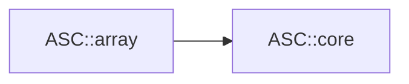

# Array Module Design

**Status:** Approved by the Lead Architect for Array Milestone 1 implementation  
**Date:** 2026-07-22  
**Authority:** `architecture_blueprint_v1.md` and the Phase III Array team  
**Public component:** `ASC::array`

## 1. Purpose

Array M1 introduces the canonical dense descriptor, view, and ownership model
required by the approved architecture. It is an additive migration milestone:
new code can use mixed extents, 64-bit mappings, element-const views, and a
move-only owner without depending on the legacy memory manager or device
singleton, while existing `UArray`, `DenseMArray`, sparse arrays, expressions,
and linalg/random consumers retain their characterized behavior.

This design existed before every Array M1 production, test, and user-guide
change. The three Array roles may implement only the surface and semantics
frozen here. A newly discovered architectural conflict returns to the Lead
Architect instead of being redesigned inside implementation.

## 2. Team roles

### Implementation Engineer

Owns the canonical Array headers, template implementation, explicit CMake file
sets, aggregate integration, and compatibility-preserving production changes.

### Testing Engineer

Owns `tests/array`, minimal `ASC::array` linkage, functional and property tests,
ownership and failure-resource tests, compile contracts, dependency/header/ODR
checks, sanitizer and configuration coverage, and the installed Array consumer.

### Documentation Engineer

Owns the Array module and migration guides and reconciles shared API,
architecture, backend, testing, inventory, Core-transition, and README claims
with behavior verified by the completed module.

## 3. M1 scope and deferred work

Array M1 owns:

- mixed static/dynamic, fixed-rank, 64-bit extents;
- checked column-major, row-major, and non-negative-stride mappings;
- a default accessor and lightweight non-owning `TensorView`;
- distinct mutable-element and const-element view types;
- a move-only `Tensor` backed by canonical Core `Buffer`;
- explicit synchronous deep clone through an `ExecutionContext`;
- initial structural tensor concepts;
- a canonical `<asc/array.h>` umbrella;
- focused tests, package coverage, dependency enforcement, and documentation.

M1 deliberately does not:

- adapt or deprecate `UArray`, `MShape`, `DenseMArray`, `MArrayView`, current
  dense aliases, `MIndex`, `MIterator`, `CArray`, or their behavior;
- replace legacy expressions or implement canonical broadcasting/evaluation;
- add slice, transpose, permutation, or reshape view transforms;
- split legacy sparse storage into COO builders and finalized CSR/CSC matrices;
- provide device-only owners/views, transfers, adopted ownership, asynchronous
  array operations, or a mutable default context;
- preserve a canonical owner copy constructor, implicit pointer conversion,
  ownership Boolean, mirroring, synchronization, or execution preference;
- introduce public provider interfaces or optional SDK types.

Those items are separately reviewable Array M2--M4 work. In particular, sparse
and expression breadth in legacy headers is compatibility surface, not the
canonical design.

## 4. Dependency contract

The only Array component edge is:



Canonical Array headers may include the C++ standard library and canonical
Core configuration, types, status/result, contracts, memory space/resource,
buffer, and execution context. They must not include:

- legacy Core `error.h`, `globals.h`, `memory.h`, `device.h`, `forall.h`,
  `cuda.h`, operators, or stream policy;
- Utilities, Linalg, Random, `<asc/cpp.h>`, or `<asc/asc.h>`;
- CUDA, OpenMP, BLAS/LAPACK, Eigen, MKL, PETSc, Kokkos, or another provider SDK.

Legacy Array headers temporarily retain their existing legacy Core includes.
They are excluded from the canonical dependency scan and remain covered by
compatibility header and regression tests. `ASC::array` publicly links only
`ASC::core`.

## 5. Public and source surface

M1 adds these installed public headers:

```text
include/asc/array.h
include/asc/array/extents.h
include/asc/array/layout.h
include/asc/array/accessor.h
include/asc/array/tensor_view.h
include/asc/array/tensor.h
include/asc/array/tensor_concepts.h
```

Small implementation-only template helpers may live under
`include/asc/array/detail/`. They are not a supported API and are not included
directly by user documentation.

`src/array/CMakeLists.txt` owns every canonical and compatibility header
explicitly. M1 adds no artificial compiled kernel: metadata, accessor, view,
and scalar-generic owner behavior is necessarily template-visible. The
existing compiled Array target and legacy translation units remain in
`src/array`.

`<asc/array.h>` includes only the canonical M1 surface. `<asc/cpp.h>` includes
the canonical umbrella and retains its existing legacy `<asc/array/marray.h>`
include during migration. No new public target is created.

## 6. Canonical vocabulary and templates

The public model is:

```text
Extents + LayoutMapping + Accessor = TensorView
Buffer + contiguous mapping        = Tensor
```

Canonical declarations use the flat `asc` namespace:

```cpp
template <extent_t... StaticExtents>
class Extents;

template <std::size_t Rank>
using DynamicTensorExtents = /* Extents<dynamic_extent, ...> */;

enum class LayoutOrder { kLeft, kRight };

template <typename ExtentsType, LayoutOrder Order>
class ContiguousLayoutMapping;

template <typename ExtentsType>
using LayoutLeftMapping =
    ContiguousLayoutMapping<ExtentsType, LayoutOrder::kLeft>;

template <typename ExtentsType>
using LayoutRightMapping =
    ContiguousLayoutMapping<ExtentsType, LayoutOrder::kRight>;

template <typename ExtentsType>
class LayoutStrideMapping;

template <typename Element>
class DefaultAccessor;

template <typename Element, typename ExtentsType,
          typename Mapping = LayoutLeftMapping<ExtentsType>,
          typename Accessor = DefaultAccessor<Element>>
class TensorView;

template <typename T, typename ExtentsType,
          typename Mapping = LayoutLeftMapping<ExtentsType>>
class Tensor;
```

The explicit `DynamicTensorExtents` spelling avoids the retained legacy
`DynamicExtents` integer-sequence alias. The implementation must not rename or
shadow that legacy public template. The canonical default is left/column-major
and does not vary with `ASC_USE_ROW_MAJOR` or another consumer macro.

## 7. Extent semantics

`Extents` has compile-time rank and accepts any mixture of non-negative static
extents and the canonical `dynamic_extent` sentinel. A static value below zero
other than the sentinel is a compile error.

- Rank zero is a scalar descriptor with logical size one.
- A zero extent is valid and makes logical size zero.
- Dynamic values use `extent_t` and must be non-negative.
- `Rank()`, `DynamicRank()`, and `StaticExtent(dimension)` are compile-time
  observers; `GetExtent(dimension)` is the runtime observer.
- A default value sets every dynamic extent to zero.
- `Create(...)` accepts exactly the dynamic values in dimension order and
  returns `Result<Extents>` for runtime validation.
- Wrong dynamic arity is rejected by constraints at compile time.
- `GetSize()` returns `Result<extent_t>` and detects multiplication overflow.
- Equality compares all logical extents.

Metadata construction and mapping never allocate. Values greater than
`INT_MAX` are valid when their checked calculations fit `extent_t`.

## 8. Mapping semantics

Every mapping stores an `ExtentsType`, uses `index_t` coordinates and
`stride_t` strides, and exposes rank, extents, logical size, per-axis strides,
required backing span, and contiguity. Mapping factories return a status for
invalid metadata or checked multiply/add overflow.

For extents `e` and coordinates `i`:

- left/column-major has `stride[0] = 1` and
  `stride[d] = stride[d-1] * e[d-1]`;
- right/row-major has `stride[rank-1] = 1` and
  `stride[d] = stride[d+1] * e[d+1]`;
- a stride mapping stores caller-supplied non-negative strides;
- every offset is `sum(i[d] * stride[d])`;
- required span is zero when any extent is zero, one for rank zero, otherwise
  `1 + sum((e[d] - 1) * stride[d])`.

Left and right mappings are unique, exhaustive, and contiguous. A stride map
may be non-contiguous or non-unique; zero stride is valid and represents a
broadcast/aliased dimension. `IsUnique()` uses a conservative, allocation-free
proof: after ignoring dimensions of extent at most one and sorting remaining
dimensions by stride, every stride must be non-zero and at least the span
covered by preceding dimensions. `false` means uniqueness is not proven; it
does not claim that every rejected pattern has duplicate offsets.

`TryOffset(...)` returns `Result<index_t>` for untrusted coordinates.
`operator()(...)` enforces rank and bounds with release-active contracts.
`UncheckedOffset(...)` is the explicitly named hot-path operation and requires
the caller to have established bounds. Negative strides, padding policies, and
negative indexing are not canonical M1 behavior.

Contiguity means that the mapping is exhaustive and matches either canonical
left or right strides after ignoring extent-one dimensions. An empty mapping
is contiguous and unique vacuously.

## 9. Accessor and view contract

`DefaultAccessor<Element>` is a stateless pointer accessor defining element,
data-handle, reference, offset, and access operations. It performs no memory
movement or synchronization.

`TensorView` stores only a data handle, mapping, accessor, available backing
span, and memory space. Its factory validates:

- the available span is non-negative and at least the mapping's required span;
- a nonempty required span has a non-null data handle;
- M1 storage is host-accessible;
- a mutable-element view has a mapping whose uniqueness is proven.

Const-element views may use non-unique mappings, including broadcast strides.
A `TensorView<T, ...>` converts to the corresponding `TensorView<const T, ...>`;
the reverse conversion does not exist. A const owner produces only a
const-element view. Constness of the view handle itself does not change element
constness, matching `std::span`; safety is carried by the `Element` type.

Canonical views:

- are non-owning and trivially copyable for the default accessor and mappings;
- have no implicit raw-pointer conversion;
- expose explicit data, descriptor, extent, stride, span, and memory-space
  observers;
- return a status from checked pointer access for untrusted coordinates;
- provide contract-checked `operator()` and explicitly unchecked access;
- never allocate, transfer, synchronize, select execution, or extend lifetime.

The caller must keep the complete backing allocation alive until every view
use finishes. No test may attempt to observe a dangling view.

## 10. Owner and clone contract

`Tensor<T, ExtentsType, Mapping>` owns a canonical `Buffer<T>` and a mapping.
M1 owners accept only mappings declared unique, exhaustive, and contiguous;
arbitrary strided owners are not supported.

- The default owner is valid and has no descriptor or allocation.
- A zero-size descriptor is distinct from the default owner and is preserved.
- `Create(extents, resource)` and `Create(extents, context, space)` return
  `Result<Tensor>`.
- Validation and checked span calculation occur before allocation.
- M1 rejects a non-host-accessible resource/space before pointer acquisition.
- Copy construction and copy assignment are deleted.
- Move operations are no-throw for canonical mappings, transfer exactly one
  ownership, and leave the source in the default empty state.
- There is no implicit pointer conversion, public ownership switch, resize,
  reserve, mirror, or manual release.
- Mutable `View()` and const `View()` return status-bearing mutable-element and
  const-element views respectively.

Deep copy is spelled `Clone`. It accepts an explicit `ExecutionContext` and
either a destination resource or destination space. M1 requires synchronous
serial capability and host-accessible source/destination storage, preserves
extents and mapping order, allocates exactly one destination buffer, copies
logical values, and returns a distinct owner. Unsupported capability,
resource failure, or non-copyable element behavior returns status without
modifying the source or publishing a partial destination.

Owners are not thread-safe for concurrent mutation. Independent owners and
read-only views have no Array-owned mutable global state.

## 11. Concepts

`tensor_concepts.h` defines structural, operation-oriented concepts for:

- descriptor/mapping observability;
- readable and writable element access;
- contiguous tensors;
- exact-rank vectors and matrices.

Concept satisfaction is based on expressions and associated scalar/metadata
types, not inheritance from ASC classes. `Vector` means exactly rank one and
`Matrix` exactly rank two; scalars are not silently accepted as vectors and
vectors are not matrices. `array/concepts.h` remains the explicitly legacy,
nominal concept surface until its consumers migrate.

## 12. Compatibility boundary

M1 does not make legacy owners move-only or change their integer metadata,
default layout, mirroring, copy, alias, sparse, or expression behavior. The
following remain available only through narrow legacy headers and the
compatibility aggregate:

```text
MShape / DShape
LayoutLeft / LayoutRight / LayoutStride / DefaultLayout
MIndex / MIterator
UArray
DenseMArray / MArrayView / DVector / DMatrix / static aliases
MObject / Expression
SparseMArray and sparse layout/index/iterator aliases
CArray
```

Canonical documentation must not present these as implementing the new
ownership or dependency contract. Later adapters may forward familiar aliases
only when they can do so without mutable views from const owners, ownership
flags, implicit migration, or permanent duplicate hierarchies.

## 13. Test architecture

`tests/array` contains focused executables linked only to `ASC::array` and
GoogleTest:

```text
asc-cpp.array.extents
asc-cpp.array.layout
asc-cpp.array.tensor-view
asc-cpp.array.tensor
asc-cpp.array.release-contract
asc-cpp.array.dependency-boundary
asc-cpp.array.odr
```

Coverage includes:

- rank-zero, zero, static, dynamic, and mixed extents;
- negative values, checked product/span/offset overflow, and metadata beyond
  `INT_MAX` without allocation;
- exact left/right/stride formulas, holes, aliases, contiguity, uniqueness,
  checked bounds, and layout-independent logical coordinates;
- external views, available-span validation, host accessibility, mutable to
  const conversion, forbidden reverse conversion, and const-owner typing;
- move-only/no-throw canonical owners, default and zero-size descriptors,
  allocation/deallocation counts, failure rollback, moved-from state, and
  explicit deep-clone independence;
- structural third-party concept satisfaction and exact vector/matrix ranks;
- release-active contracts, header isolation, canonical forbidden includes,
  exact public target dependency, and representative multi-TU instantiation.

The existing `generic` suite remains the legacy compatibility regression gate.
The installed `ASC::array`-only consumer includes `<asc/array.h>`, constructs a
mixed-extent tensor, mutates through a mutable view, reads through a const view,
clones explicitly, and verifies non-aliasing. The old aggregate consumer
behavior remains covered separately.

## 14. Per-module completion gate

Array M1 is complete only after all of the following pass:

1. focused default Array tests;
2. the complete default suite, including generic compatibility and installed
   package relocation;
3. strict warnings-as-errors build and tests;
4. focused AddressSanitizer/UndefinedBehaviorSanitizer tests;
5. applicable exception-disabled and assertion-disabled positive/status tests;
6. production and Array-test lint;
7. canonical header isolation, multi-TU ODR, and dependency scan;
8. installed minimal-component consumer;
9. Lead review that `ASC::array -> ASC::core` is the only component edge;
10. completed module, migration, shared-documentation, and claim audit.

The sanitizer command uses explicit `ASAN_OPTIONS` when required by the local
runtime to avoid its known recursive default signal-handler loop; this does not
suppress sanitizer findings.

## 15. Documentation deliverables

After implementation and verification, the Documentation Engineer creates:

```text
docs/modules/array.md
docs/migration/array.md
```

and reconciles `README.md`, `docs/api.md`, `docs/architecture.md`,
`docs/testing.md`, `docs/optional-backends.md`,
`docs/migration/inventory.md`, `docs/modules/core.md`, and
`docs/migration/core.md`. Every guide distinguishes canonical M1, retained
compatibility, and planned work. Examples use only shipped behavior and the
minimal `ASC::array` component.

## 16. Later milestones

- **Array M2:** migrate `UArray` and dense storage inward; add reviewed
  zero-copy slice, transpose, permutation, and reshape views.
- **Array M3:** centralize shape algebra, trailing-axis broadcasting, alias
  analysis, lifetime-safe pointwise expressions, and context-driven `Assign`.
- **Array M4:** introduce a mutable rank-two COO builder and finalized CSR/CSC
  owners/views with validated, sorted, coalesced structure.
- **Provider milestones:** add explicit device pointer/accessor and transfer
  contracts only after Core resources/providers expose them; never infer an
  implicit transfer from element access.
