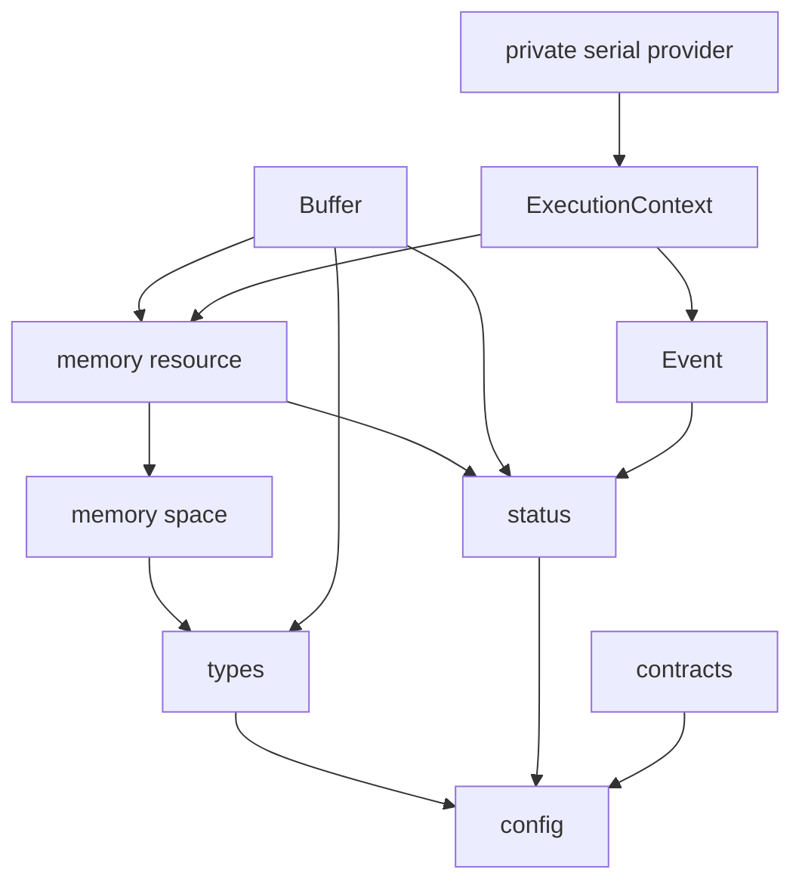

# Core Module Design

> **Superseded historical document.** This file describes the deleted implementation at historical HEAD `33b261ea33616a6395c4ad3b20646093103344f7`; it is retained only for auditability and is not current API, build, package, or implementation guidance. See the [approved Stage A six-module blueprint](../development/asc-cpp-architecture/architecture-blueprint.md).

**Status:** Approved by the Lead Architect for Core Milestone 1 implementation  
**Date:** 2026-07-22  
**Authority:** `architecture_blueprint_v1.md` and the Phase III core team  
**Public component:** `ASC::core`

## 1. Purpose

This document freezes the first implementable core increment before any core
source, test, or user-documentation change is made. It resolves the core
decisions assigned by the approved architecture blueprint and defines the
interfaces that the Implementation, Testing, and Documentation Engineers must
build together.

Core Milestone 1 (M1) is deliberately additive. It establishes the canonical
serial foundation beside the legacy MdeCpp-derived runtime. It does not replace
legacy `Memory<T>`, `MemoryManager mm`, `Device`, or `forall` yet because the
current array module relies on their aliasing, mirroring, and manual-lifetime
behavior. Replacing those internals before array owners and views are separated
would create an unreviewable cross-module rewrite.

The new canonical APIs must not depend on the legacy runtime. Later milestones
adapt legacy APIs inward to the canonical foundation and remove them only after
their array consumers have migrated.

## 2. Team roles

### Implementation Engineer

Owns canonical headers, compiled runtime sources, the serial provider, core
CMake ownership, and compatibility-preserving integration. The engineer must
not change legacy behavior in M1.

### Testing Engineer

Owns `tests/core`, minimal `ASC::core` linkage, ownership/failure/concurrency
tests, compile properties, header isolation, ODR coverage, and package-consumer
verification.

### Documentation Engineer

Owns the core user guide and updates to API, architecture, backend, testing,
and migration documentation. Every shipped claim must be backed by an M1 test;
planned provider behavior must remain clearly marked as planned.

## 3. Responsibilities and non-goals

### 3.1 M1 responsibilities

Core M1 owns:

- signed fixed-width metadata types;
- stable status/result values;
- release-active public contracts;
- memory-space descriptions;
- shareable memory-resource handles and a host resource;
- a move-only RAII buffer;
- an explicit execution context with a mandatory serial provider;
- a completed-event abstraction suitable for later asynchronous providers;
- a canonical `<asc/core.h>` umbrella;
- dedicated core tests and user documentation.

### 3.2 M1 non-goals

M1 does not:

- replace or deprecate legacy `Memory<T>`, `MemoryType`, `MemoryClass`, `mm`,
  `Device`, `Read`/`Write`, `UseDevice`, or `forall`;
- provide pinned-host, CUDA, managed-memory, or OpenMP resources/providers;
- remove current CUDA link propagation or source-language behavior;
- expose a public provider-registration or binary-plugin ABI;
- implement array owners/views, tensor copying, linalg, or random kernels;
- freeze scalar promotion, tolerance, or AD math customization;
- provide external-memory adoption or a public raw device pointer;
- add a mutable default execution context;
- claim asynchronous execution beyond an immediately completed serial event.

These are staged explicitly in Section 14.

## 4. Dependency rules

`ASC::core` has no dependency on another ASC component. Canonical common
headers use only the C++ standard library and the generated core configuration.



Canonical headers must not include:

- legacy `globals.h`, `error.h`, `memory.h`, `device.h`, `forall.h`, or
  `cuda.h`;
- headers from `utilities`, `array`, `linalg`, or `random`;
- CUDA, OpenMP, BLAS/LAPACK, Eigen, MKL, PETSc, or Kokkos headers.

Legacy headers may depend inward on canonical headers in a later milestone;
canonical headers never depend outward on legacy APIs.

## 5. Public file surface

M1 adds:

```text
include/asc/core.h
include/asc/core/types.h
include/asc/core/status.h
include/asc/core/contracts.h
include/asc/core/memory_space.h
include/asc/core/memory_resource.h
include/asc/core/buffer.h
include/asc/core/event.h
include/asc/core/execution_context.h

src/core/runtime/contracts.cc
src/core/runtime/memory_resource.cc
src/core/runtime/event.cc
src/core/runtime/execution_context.cc
src/core/providers/serial/serial_provider.cc
```

`<asc/core.h>` includes the canonical M1 headers and stable lightweight core
facilities such as configuration, casts, math, and string helpers. It does not
include legacy device, CUDA, memory-manager, `forall`, global-stream, or
device-coupled operator headers. Existing narrow legacy headers remain
available and `<asc/cpp.h>` remains source-compatible.

**Post-implementation review:** M1 implements `<asc/core.h>` as the canonical
headers plus configuration only. The current casts and string helpers
transitively include legacy error/global-stream facilities; math also reaches
device-coupled operators, device, and memory. Including them would violate
Section 4's canonical dependency boundary. They remain available as narrow
compatibility headers, `<asc/cpp.h>` remains compatible, and the helpers may
join the canonical umbrella only after those transitive dependencies are
removed. The Lead Architect approved this bounded deviation; it does not
change the canonical M1 contracts.

All headers belong to the existing `asc_core` public file set. No new exported
target or public component is created.

## 6. Fundamental types

`<asc/core/types.h>` defines:

- `index_t` as signed 64-bit;
- `extent_t` as signed 64-bit;
- `stride_t` as signed 64-bit;
- `nnz_t` as signed 64-bit;
- `dynamic_extent` as the `extent_t` value `-1`.

`std::size_t` remains the byte-count type. Negative counts are invalid. Element
count multiplication is checked before allocation. Narrowing into backend
integer types must be checked at the future provider boundary.

The legacy integer `kDynamicExtent` remains unchanged in M1 to avoid an array
API change. `real_t` remains an ABI-selected convenience alias, not the generic
scalar contract.

Scalar traits are deferred until the array and linalg teams can jointly freeze
promotion, accumulation, mathematical customization, tolerance, and
device-operability requirements.

## 7. Status and result model

`<asc/core/status.h>` defines the stable codes:

```text
kOk
kInvalidArgument
kOutOfRange
kFailedPrecondition
kOverflow
kAllocationFailed
kUnavailable
kUnsupported
kBackendError
kNumericalFailure
kInternal
```

`Status` is a nodiscard value with:

- default and named successful construction;
- failed construction from code and message;
- optional provider name and signed native provider code;
- `ok()`, `code()`, `message()`, `provider()`, `provider_code()`, and explicit
  Boolean inspection.

Provider text is diagnostic and must not be parsed as a stable API. The ASC
status code is stable.

`Result<T>` is a nodiscard header-defined value that stores either `T` or a
non-success `Status`. It supports move-only `T` and provides lvalue, const
lvalue, and rvalue value access. `Result<void>` is not provided; operations
without a value return `Status`.

Constructing a failed result with an OK status is a contract violation. Access
to a missing value is also a contract violation and routes through one compiled
translation function, rather than leaking `std::variant` exception behavior.

Status-returning APIs exist and have the same signatures whether legacy
exception translation is enabled or disabled.

## 8. Contracts

`<asc/core/contracts.h>` defines:

- `ContractKind`: precondition, postcondition, and invariant;
- a compiled no-return `ContractFailure` function carrying expression,
  message, and `std::source_location`;
- always-active `ASC_REQUIRE` and `ASC_ENSURE` macros;
- debug-only `ASC_DCHECK`.

Each macro must be statement-safe and evaluate its condition exactly once.
Public programmer-contract violations use `ASC_REQUIRE`/`ASC_ENSURE` and remain
active with `NDEBUG` or assertions disabled. Recoverable allocation, provider,
and numerical failures return status instead.

Under the configured exception mode, contract failure throws a dedicated
contract exception. Otherwise it writes a minimal diagnostic and aborts. The
canonical contract path introduces no mutable global error policy. Legacy
`ASC_VERIFY`, `ASC_ASSERT`, `ASC_ABORT`, `ErrorAction`, and their message format
remain unchanged in M1.

## 9. Memory spaces and resources

### 9.1 Memory spaces

`MemorySpace` contains:

- host;
- pinned host;
- device;
- managed/unified.

Host-accessible spaces are host, pinned host, and managed. Device-accessible
spaces are device and managed. Managed memory remains semantically distinct
from host memory.

External ownership is not a memory space. A future adopted allocation records
both its real address space and its resource/deleter policy.

### 9.2 Memory resources

`MemoryResource` is the abstract allocation boundary. It provides:

- its memory space and stable diagnostic name;
- byte allocation with explicit alignment and status failure;
- no-throw deallocation with matching bytes/alignment;
- resource equality.

`MemoryResourcePtr` is a shared resource handle. A buffer retains this handle,
so the resource/deleter remains valid even when the creating context or caller's
local resource handle is destroyed.

M1 ships one immutable, thread-safe host resource returned by
`GetHostMemoryResource()`. A zero-byte allocation succeeds with a null pointer.
Invalid alignment is rejected. Allocation failure is reported without relying
on a real out-of-memory event in tests.

M1 declares no fake resource for a backend it does not implement.

## 10. Buffer ownership

`Buffer<T>` is the canonical low-level owner.

### 10.1 Required semantics

- Default construction produces a valid empty buffer.
- Allocation uses a static `Allocate` factory returning `Result<Buffer<T>>`.
- Counts use `extent_t`; negative counts fail.
- `count * sizeof(T)` is checked before a resource call.
- A zero count produces a valid empty buffer without allocation.
- The buffer retains its resource handle and allocation metadata.
- Copy construction and copy assignment are deleted.
- Move construction and assignment are no-throw, transfer one ownership, and
  leave the source valid and empty.
- Destruction is no-throw and releases exactly once.
- Non-trivial host objects are default-constructed and destroyed with rollback
  after partial construction failure. Fundamental values are not value-filled.
- Host access returns `Result<T*>`/`Result<const T*>` and succeeds only for a
  host-accessible space.
- There is no implicit pointer conversion, resize, aliasing, mirroring,
  execution preference, public raw device accessor, or manual delete.

Observers report size, byte size, emptiness, memory space, and retained memory
resource. They do not synchronize or migrate memory.

### 10.2 Explicit copying

Deep copying is intentionally absent from Core M1. The canonical copy/clone
operation must accept an `ExecutionContext`, source/destination spaces, and
explicit synchronization semantics. That contract is finalized with array
owners rather than shipping a host-only member that later changes meaning.

### 10.3 External storage

A non-owning external pointer belongs in a future view. Adoption requires an
explicit resource/deleter and lifetime contract. It is deferred rather than
being represented by an ambiguous `own` Boolean.

## 11. Execution context

### 11.1 Public values

Core M1 defines:

- backend kinds: serial, OpenMP, and CUDA;
- fallback policies: disallow, and same-space reference;
- determinism policies: best effort, and require deterministic;
- capabilities for synchronous/asynchronous execution and supported memory
  spaces;
- immutable construction options containing backend, device identifier,
  fallback policy, and determinism policy.

### 11.2 Context contract

`ExecutionContext` is a cheap copyable handle to immutable shared state.

- `Serial()` always returns a valid deterministic serial context.
- `Create(options)` validates options. M1 returns `kUnavailable` for OpenMP and
  CUDA rather than pretending they exist.
- Accessors report backend, device, fallback, determinism, and capabilities.
- A memory-resource query returns the resource for a supported space or a
  status before pointer acquisition.
- `Synchronize()` waits for provider work and returns status.
- Two contexts have independent option/state values.
- Copies of one immutable context may be used concurrently for supported
  serial operations.
- No public provider registration, SDK type, mutable setter, global registry,
  or mutable default context exists in M1.
- Fallback is disabled by default and never performs an implicit transfer.

The legacy `Device` remains the compatibility default only for legacy
algorithms. New canonical APIs require an explicit context. A thread-local
convenience default may be proposed later after explicit-context call sites are
established.

## 12. Event contract

`Event` is a cheap copyable shared-state handle.

- A default event is completed successfully.
- `IsReady()` is a non-blocking readiness query.
- `Wait()` is idempotent and returns the provider status.
- The event reports its backend kind.
- Destruction does not silently wait.
- An event retains provider event state, not operand buffers/views.
- Callers must keep all operation storage alive until the event completes.

M1 serial work completes synchronously, so it produces completed events. The
private event-state boundary permits future provider events without changing
the public event shape.

## 13. Backend and compilation boundary

Serial is the only canonical M1 provider. Its implementation lives under
`src/core/providers/serial` and depends on the canonical context/resource
contracts.

Common headers contain no provider SDK declaration. No CUDA, OpenMP, Eigen,
MKL, BLAS/LAPACK, PETSc, or Kokkos type appears in the canonical API.
cuBLAS/cuSPARSE remain a known legacy build issue until linalg/provider
isolation; they are never used by new core code.

The provider SPI remains private and compiled in. A binary plugin ABI is out of
scope.

## 14. Compatibility and later core milestones

| Legacy API/mechanism | M1 | Later action |
|---|---|---|
| `Memory<T>` and manual `Delete()` | unchanged compatibility | adapt through allocation-local compatibility state after array migration |
| `MemoryManager mm` | unchanged compatibility | eliminate after aliases/views no longer use global pointer identity |
| `Device` singleton | unchanged compatibility | adapt callers to explicit contexts, then remove |
| `Read`/`Write`/`UseDevice` | unchanged compatibility | replace with explicit views, spaces, copy, and context |
| `forall` macros | unchanged compatibility | separate explicit user-kernel extension from compiled operations |
| legacy error macros/action | unchanged compatibility | forward where semantics permit after message/failure characterization |
| global streams | unchanged compatibility | replace diagnostics with context/scoped sinks in provider hardening |
| CUDA/OpenMP legacy build propagation | unchanged compatibility | isolate in Core M3/provider work |

Core M2 covers compatibility forwarding and allocation-local legacy mirroring
after required characterization. Core M3 isolates real OpenMP/CUDA resources,
contexts, events, and translation units. Device/mm removal occurs only after
array owners/views no longer depend on them.

Compatibility is bounded to the pre-1.0 migration window defined by the
approved blueprint. New code must not consume compatibility APIs.

## 15. Build and source ownership

- The existing `asc_core`/`ASC::core` identity remains.
- New headers are explicit members of the core public file set.
- New compiled files are explicit members of `asc_core`.
- Runtime and serial-provider files are owned by `src/core/CMakeLists.txt`.
- No new external dependency is introduced.
- New tests link only `ASC::core`, GoogleTest, and private project options.
- Existing component/package/relocation behavior remains green.

## 16. Test design

Tests live in `tests/core` and are grouped into coherent base, memory,
execution, and compatibility coverage as build complexity permits.

### 16.1 Base and contract tests

- metadata aliases are signed and exactly 64-bit;
- the dynamic sentinel is `-1`;
- status code/message/provider fields and Boolean state;
- `Result<T>` value/error behavior, including a move-only value;
- invalid result access and public contracts follow configured translation;
- public contracts remain active in a release/no-assertion build;
- contract conditions are evaluated once.

### 16.2 Resource and buffer tests

- host resource space/name/equality, zero-size behavior, and alignment;
- deterministic counting and failing custom resources;
- negative and overflowing counts fail before allocation;
- zero/default buffer invariants;
- move-only compile traits and absence of implicit pointer conversion;
- move construction/assignment and exactly-once release;
- non-trivial object construction/destruction and failure rollback;
- mutable/const host access;
- incompatible-space access fails before pointer use;
- resource lifetime extends past the caller's local handle.

Tests use custom failure resources rather than attempting real out-of-memory.
Performance sanity is measured through allocation counts, not wall-clock time.

### 16.3 Context and event tests

- serial context identity, options, capabilities, and host resource;
- invalid device identifiers and unavailable OpenMP/CUDA status;
- no fallback or transfer during unsupported queries;
- independent serial contexts and concurrent immutable context use;
- synchronization success;
- default/completed event readiness, backend, status, copy, and idempotent wait.

### 16.4 Architecture and package tests

- each new header is self-contained and links with only `ASC::core`;
- representative `Buffer`, `Result`, and context use across multiple TUs;
- compile-time assertions reject buffer copy and implicit pointer conversion;
- canonical core files have no higher-component or provider-SDK include;
- the installed core-only consumer includes `<asc/core.h>` and exercises the
  canonical serial foundation;
- the existing 507-test behavior and package relocation remain regression
  gates.

## 17. Documentation deliverables

M1 adds `docs/modules/core.md` and updates:

- `docs/api.md` with canonical core first and a labeled compatibility section;
- `docs/architecture.md` with implemented canonical versus transitional state;
- `docs/testing.md` with the core-only suite and contract claims;
- `docs/optional-backends.md` only to distinguish shipped legacy behavior from
  the planned isolated-provider architecture;
- migration documentation with the M1 mapping and bounded legacy path.

Examples must compile as tests before being presented as guaranteed usage.

## 18. M1 acceptance gate

Core M1 is complete only when:

- this design predates all module code/test changes;
- canonical headers never include legacy runtime or higher modules;
- new buffer ownership is RAII, move-only, and allocation-failure safe;
- the serial context and event contracts are implemented and tested;
- core tests link only `ASC::core`;
- canonical headers pass self-containment and representative ODR checks;
- a core-only installed consumer uses the canonical API;
- default and strict builds/tests pass;
- sanitizer and exception-disabled status paths are checked where supported;
- dependency and documentation reviews find no claim beyond implementation;
- all pre-existing tests and package-relocation checks remain green.

Only after this gate may the Lead Architect mark core M1 complete and begin the
utilities module design.
