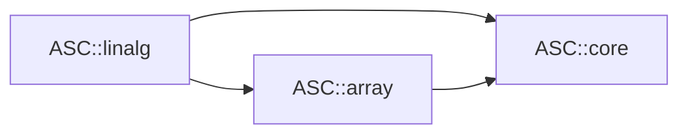

# Linalg Module Design

**Status:** Approved by the Lead Architect for Linalg Milestone 1 implementation  
**Date:** 2026-07-22  
**Authority:** `architecture_blueprint_v1.md` and the Phase III Linalg team  
**Public component:** `ASC::linalg`

## 1. Purpose

Linalg M1 establishes a small canonical BLAS foundation over the canonical
Array view model. It replaces implicit global execution, output resizing,
layout assumptions, and release-removable validation with explicit contexts,
preallocated typed views, status results, checked alias rules, and one
deterministic serial reference provider.

This is an additive migration milestone. The existing `blas.h`, `decomp.h`,
`lapack.h`, and `eigen.h` remain compatibility headers for legacy arrays and
the existing algebra characterization suite. They do not define the canonical
M1 contract.

This file existed before every Linalg M1 production, test, and user-guide
change. Implementation may not expand or redesign the frozen surface below.

## 2. Lead resolution of the three role reviews

The three roles agreed on a canonical context-taking BLAS subset, exact
rank/layout/alias rules, minimal component tests, and retention of the legacy
algebra suite. The Implementation Engineer also proposed LU and Cholesky
factorization in M1.

The Lead defers factorization to Linalg M2. Reusable factors require a coherent
decision on canonical workspace ownership, pivot storage, multiple right-hand
sides, scalar traits, provider handles, and repeated-solve allocation rules.
Landing two provisional factor types together with the first view kernels would
make those decisions accidental. M1 instead completes the compiled provider
boundary and seven precisely specified BLAS operations on which factors can
later depend.

The Lead also rejects leaving `ASC::linalg` permanently interface-only. The
approved blueprint requires a compiled-plus-template component. M1 therefore
ships compiled float/double serial kernels and capability/runtime translation,
with thin constrained template facades in public headers.

## 3. Team roles

### Implementation Engineer

Owns the canonical public headers, compiled serial reference provider, runtime
capability translation, Linalg target conversion, aggregate integration, and
compatibility-preserving production changes.

### Testing Engineer

Owns `tests/linalg`, mathematical and failure tests, alias/transaction checks,
minimal linkage, dependency/header/ODR checks, configuration/sanitizer gates,
performance-allocation sanity, and the installed Linalg consumer.

### Documentation Engineer

Owns Linalg module and migration guides and reconciles shared API,
architecture, build, backend, testing, inventory, Core, and Array documents
with the verified implementation.

## 4. Legacy baseline

The current Linalg surface is four broad installed headers:

- `blas.h` mixes pointwise functions, logical operations, reductions, BLAS,
  contractions, Kronecker/cross products, legacy memory access, and execution;
- `decomp.h` contains portable decomposition algorithms over nominal legacy
  array concepts;
- `lapack.h` combines options, decompositions, solvers, automatic policy, and
  optional Eigen paths;
- `eigen.h` exposes provider-native conversion and a second solver hierarchy.

The historical `tests/algebra` suite remains useful behavior evidence. It uses
legacy owners, 32-bit metadata, global memory/device fixtures, implicit output
management, and legacy failure paths, so it is not counted as canonical M1
coverage. Pointwise/transcendental/logical operations in legacy `blas.h` belong
to a future canonical Array evaluation layer rather than canonical Linalg.

## 5. M1 responsibilities and non-goals

Linalg M1 owns exactly:

- BLAS1 `Copy`, `Scal`, `Axpy`, `Dot`, and `Nrm2`;
- BLAS2 `Gemv`;
- BLAS3 `Gemm`;
- explicit `ExecutionContext` dispatch;
- a queryable serial-reference capability value;
- compiled float and double kernels;
- stable shape, memory, alias, empty-input, status, numerical-order, and
  determinism semantics;
- the canonical `<asc/linalg.h>` umbrella;
- focused tests, package coverage, dependency enforcement, and documentation.

M1 does not add:

- pointwise functions, broadcasting, general reductions, or expression nodes;
- `Swap`, `Axpby`, `Asum`, `Iamax`, `Ger`, symmetric, triangular, or banded
  BLAS operations;
- `MatMul`, `Outer`, tensor contraction, Kronecker product, or cross product
  convenience APIs;
- complex/conjugate transpose, integer, mixed-precision, long-double, AD, or
  custom scalar support;
- LU, Cholesky, QR, SVD, eigenvalue, least-squares, determinant, inverse, or
  reusable solver/factorization types;
- sparse or matrix-free operations;
- implicit allocation, resizing, materialization, transfer, synchronization,
  or provider fallback through another address space;
- Eigen, MKL, BLAS/LAPACK, CUDA, or public provider-SPI types in canonical
  headers;
- asynchronous operations or a public binary plugin ABI.

## 6. Dependency contract

Canonical Linalg has two direct component dependencies because its public
headers name both Array views and Core context/status types:



Canonical files may include the C++ standard library, canonical Core, canonical
Array, and other canonical Linalg headers. They must not include:

- Utilities, Random, `<asc/cpp.h>`, or `<asc/asc.h>`;
- legacy Core error, globals, memory, device, forall, CUDA, or stream policy;
- legacy Array owners, shapes, layouts, expressions, sparse types, or aliases;
- legacy Linalg `blas.h`, `decomp.h`, `lapack.h`, or `eigen.h`;
- Eigen, MKL, BLAS/LAPACK, CUDA, OpenMP, PETSc, Kokkos, or provider SDK headers.

In the base build `ASC::linalg` publicly links exactly `ASC::array` and
`ASC::core`. Conditional Eigen/MKL usage requirements remain only for explicit
legacy compatibility headers until a later adapter/provider split; they are
never included by the canonical umbrella and do not change canonical API.

## 7. Public, internal, and source surface

M1 adds:

```text
include/asc/linalg.h
include/asc/linalg/concepts.h
include/asc/linalg/capabilities.h
include/asc/linalg/blas1.h
include/asc/linalg/blas2.h
include/asc/linalg/blas3.h
include/asc/linalg/detail/reference_kernels.h

src/linalg/runtime/capabilities.cc
src/linalg/providers/serial/reference_kernels.cc
```

The existing `include/asc/linalg/types.h` becomes part of the canonical narrow
surface while retaining source compatibility. `TransposeMode` is the only
mode used by M1.

`<asc/linalg.h>` includes canonical concepts, modes, capabilities, and the
three BLAS headers. It never includes a legacy monolith or optional adapter.
`<asc/cpp.h>` adds the canonical umbrella and retains the legacy headers during
migration.

`detail/reference_kernels.h` is installed because public constrained facades
dispatch to its exported float/double entry points. The `asc::detail` names are
not supported user APIs.

## 8. Target and provider structure

`asc_linalg` changes from an interface target to a normal compiled target. Its
public file set contains both canonical and compatibility headers. Its compiled
sources contain no optional provider type.

The M1 provider is named `serial-reference`. Dispatch occurs once per public
operation. Compiled kernels receive validated raw pointers, 64-bit extents and
strides, scalar values, and mode values. The hot loops do not perform runtime
provider dispatch.

The capability surface is:

```cpp
enum class LinalgOperation {
  kCopy, kScal, kAxpy, kDot, kNrm2, kGemv, kGemm
};

class LinalgCapabilities {
 public:
  BackendKind GetBackend() const noexcept;
  std::string_view GetProviderName() const noexcept;
  bool IsDeterministic() const noexcept;
  bool Supports(LinalgOperation operation) const noexcept;
};

Result<LinalgCapabilities> GetLinalgCapabilities(
    const ExecutionContext& context);
```

A serial context returns support for all seven operations, provider
`serial-reference`, backend `kSerial`, and deterministic behavior. M1 cannot
construct another valid Core context, so invocation through a non-serial
context is not an M1 test claim. Future contexts with disallowed fallback
return `kUnavailable`; a future same-space-reference fallback may select this
provider only for host-accessible operands and must never transfer.

Capability determinism means repeated execution by the same built provider on
the same inputs follows the same operation order. It is not a cross-compiler,
cross-architecture, or fast-math bitwise promise.

## 9. Canonical concepts and scalar contract

`linalg/concepts.h` builds structurally on canonical Array concepts. Canonical
Linalg operands expose:

- exact compile-time rank;
- `ElementType`, `ValueType`, mapping/extents types, and a raw pointer data
  handle;
- 64-bit extent, stride, logical-size, required-span, and available-span
  observations;
- memory-space, contiguity, and uniqueness observations.

`ReadableLinalgVector` and `WritableLinalgVector` require exact rank one.
`ReadableLinalgMatrix` and `WritableLinalgMatrix` require exact rank two.
Writable operands must carry non-const element authority; runtime validation
also requires a proven-unique mapping. Owners are not kernel arguments: callers
obtain a view explicitly with `Tensor::View()`.

M1 accepts exactly one identical `ValueType` across all operands and scalar
parameters. Supported types are `float` and `double`. Boolean, integer,
long-double, mixed, complex, AD, and custom types fail constraints rather than
silently narrow or select legacy behavior. Scalar traits and complex
conjugation are an explicit later design.

## 10. Public operation signatures

The flat-namespace overloads are distinguished from legacy operations by the
mandatory context first argument:

```cpp
Status Copy(const ExecutionContext& context,
            const ReadableLinalgVector& x,
            const WritableLinalgVector& y);

Status Scal(const ExecutionContext& context, T alpha,
            const WritableLinalgVector& x);

Status Axpy(const ExecutionContext& context, T alpha,
            const ReadableLinalgVector& x,
            const WritableLinalgVector& y);

Result<T> Dot(const ExecutionContext& context,
              const ReadableLinalgVector& x,
              const ReadableLinalgVector& y);

Result<T> Nrm2(const ExecutionContext& context,
               const ReadableLinalgVector& x);

Status Gemv(const ExecutionContext& context, TransposeMode transpose,
            T alpha, const ReadableLinalgMatrix& a,
            const ReadableLinalgVector& x, T beta,
            const WritableLinalgVector& y);

Status Gemm(const ExecutionContext& context, TransposeMode transpose_a,
            TransposeMode transpose_b, T alpha,
            const ReadableLinalgMatrix& a,
            const ReadableLinalgMatrix& b, T beta,
            const WritableLinalgMatrix& c);
```

These are constrained function templates; the concept notation above is
descriptive of their constraints, not a type-erased or virtual interface.
Writable view handles may be passed as const references because element
authority is encoded in `ElementType`, like `std::span`.

There are no default contexts, modes, alpha values, beta values, result
allocations, or output resizes in M1.

## 11. Mathematical contracts

Let `n` be a vector extent. Logical coordinates are used independently of
physical layout and stride.

| Operation | Result |
| --- | --- |
| `Copy` | `y[i] = x[i]` |
| `Scal` | `x[i] = alpha * x[i]` |
| `Axpy` | `y[i] = alpha * x[i] + y[i]` |
| `Dot` | `sum(i=0..n-1, x[i] * y[i])` |
| `Nrm2` | `sqrt(sum(i=0..n-1, x[i]^2))` computed by scaled sum of squares |
| `Gemv` | `y = alpha * op(A) * x + beta * y` |
| `Gemm` | `C = alpha * op(A) * op(B) + beta * C` |

`TransposeMode::kNoTranspose` uses stored logical coordinates and
`kTranspose` exchanges the two matrix axes. Any other underlying enum value is
`kInvalidArgument`. M1 has no conjugation mode.

The exact shape equations are:

- BLAS1 input/output vector extents are equal;
- for `Gemv`, `x.extent(0) == op(A).extent(1)` and
  `y.extent(0) == op(A).extent(0)`;
- for `Gemm`, `op(A).extent(1) == op(B).extent(0)`, while `C` has
  `op(A).extent(0)` rows and `op(B).extent(1)` columns.

Shape and mode validation completes before data access or output mutation.

## 12. Empty and alpha/beta semantics

- Empty `Copy`, `Scal`, and `Axpy` succeed without access.
- `Dot` and `Nrm2` of two valid empty vectors return positive `T{0}`.
- A zero-length output dimension makes `Gemv`/`Gemm` a successful no-op.
- A zero inner dimension still applies `y = beta*y` or `C = beta*C`.
- When `beta == T{0}`, `Gemv` and `Gemm` do not read the previous destination;
  they directly write the computed `alpha` term. This prevents uninitialized
  or NaN destination values from contaminating a mathematically overwritten
  result.

No special `alpha == 0` no-read guarantee is made in M1. IEEE NaN and infinity
otherwise propagate through ordinary float/double arithmetic.

## 13. Layout, memory, and metadata

All operations support canonical left, right, and proven-unique non-negative
stride mappings. Kernels use each operand's real strides; no global default
layout branch exists. Padded holes are not read or written except when a
logical coordinate maps there by contract.

Every nonempty operand must have a non-null raw data handle, sufficient
available span, a host-accessible memory space, and a mapping whose checked
span arithmetic fits the canonical 64-bit types. Writable operands must be
unique. The view factory normally establishes these invariants; Linalg repeats
the operation-boundary checks before raw provider dispatch so structural
adapters cannot bypass them.

M1 performs no allocation and no host/device synchronization or transfer.
Large metadata failures can therefore be tested before any backing allocation
or dereference.

## 14. Alias and transactional rules

The implementation conservatively compares the touched byte intervals derived
from the data handle, required span, and element size. Interval arithmetic is
checked. False-positive overlap rejection for interleaved holes is permitted;
false-negative overlap is not.

| Operation | Allowed aliasing |
| --- | --- |
| `Copy` | disjoint, or exactly the same data/extents/strides (no-op) |
| `Scal` | its documented in-place operand |
| `Axpy` | disjoint, or exactly the same `x`/`y` descriptor |
| `Dot`, `Nrm2` | arbitrary read-only input overlap |
| `Gemv` | `y` must not overlap `A` or `x` |
| `Gemm` | `C` must not overlap `A` or `B`; inputs may overlap each other |

Partial or conservatively detected forbidden overlap returns
`kFailedPrecondition`. Exact-descriptor equality compares data handle, rank,
all extents, and all strides.

All status-producing validation occurs before the first output write. A
recoverable failure leaves every output byte unchanged. Arithmetic itself has
no recoverable mid-kernel status in M1.

## 15. Numerical and determinism policy

- `Dot`, `Gemv`, and `Gemm` accumulate in the operand `ValueType` in ascending
  logical inner-coordinate order.
- `Nrm2` uses a LAPACK-style scaled sum-of-squares update, avoiding the
  avoidable overflow/underflow of `sqrt(sum(x*x))` for finite representable
  inputs.
- No implicit extended accumulator, reassociation, provider-specific tolerance,
  or condition estimate is introduced.
- Results follow the active C++ floating-point environment and compiler
  contraction rules. Cross-build bitwise equality is not promised.
- Kernels have no Array/Linalg-owned mutable global state. Independent outputs
  may be operated on concurrently with independent or shared immutable
  contexts, subject to the caller's ordinary data-race obligations.

## 16. Status contract

| Condition | Status |
| --- | --- |
| Successful mutation | `Status::Ok()` |
| Shape mismatch or invalid transpose value | `kInvalidArgument` |
| Insufficient/overflowed extent, stride, span, or byte-range arithmetic | `kOverflow` |
| Non-unique output or forbidden storage overlap | `kFailedPrecondition` |
| Non-host-accessible operand or unsupported scalar/layout capability | `kUnsupported` |
| Requested execution provider absent with fallback disallowed | `kUnavailable` |
| Future native provider failure | `Status::FromProvider(...)` |

Reductions return the same failures through `Result<T>`. The seven M1
operations do not produce `kNumericalFailure`; IEEE non-finite arithmetic is a
value result, not a solver convergence status. Rank and unsupported scalar
errors are compile-time constraint failures.

## 17. Compatibility boundary

The following remain available through narrow headers and `<asc/cpp.h>` but
are not canonical M1:

```text
legacy context-free BLAS and pointwise functions in linalg/blas.h
portable decompositions in linalg/decomp.h
LAPACK-style wrappers and LinearSolver in linalg/lapack.h
Eigen maps, conversions, and solver paths in linalg/eigen.h
```

M1 does not alter their source behavior, integer sizes, auto-resizing, failure
translation, optional feature gates, or legacy array requirements. New code
includes `<asc/linalg.h>`, passes canonical views and an explicit context, and
uses status results.

The transitional `random -> linalg` edge remains because the legacy
covariance-taking sampler still calls legacy `MatMul`. Removing that edge
requires the later factor/transform migration and is not falsely claimed here.

## 18. Test architecture

`tests/linalg` adds focused executables linked only to `ASC::linalg` and
GoogleTest:

```text
asc-cpp.linalg.blas1
asc-cpp.linalg.blas2
asc-cpp.linalg.blas3
asc-cpp.linalg.release-contract
asc-cpp.linalg.dependency-boundary
asc-cpp.linalg.odr
```

Coverage includes:

- float and double, left/right/unique-stride views, padded spans, and holes;
- golden results and deterministic property identities;
- every supported transpose combination and rectangular dimensions;
- empty vectors/matrices, zero inner dimensions, alpha/beta behavior, and a
  NaN-poisoned destination proving the `beta == 0` no-read rule;
- scaled `Nrm2` at extreme finite magnitudes;
- all shape, mode, accessibility, uniqueness, span/metadata-overflow, exact
  alias, and partial-alias paths;
- failure-before-access and unchanged-output transactions;
- no provider-kernel allocation after views exist;
- compiled capability symbols and serial provider identity;
- self-contained canonical headers, exact base target edges, forbidden
  dependencies, and representative multi-TU instantiation.

`tests/algebra` remains unchanged and separately labeled as legacy migration
coverage. The installed consumer includes `<asc/array.h>` to create canonical
owners/views and `<asc/linalg.h>` for operations, but links only `ASC::linalg`;
the public `ASC::linalg -> ASC::array` edge supplies that dependency. It runs at
least one BLAS1 and one matrix operation and checks results/status.

**Post-freeze Lead resolution:** `<asc/linalg.h>` does not re-export Array
owners or descriptor construction. Requiring the installed consumer to create
views from that single include would either be impossible or make the Linalg
umbrella an accidental Array umbrella. Explicitly including both owning module
headers preserves self-contained Linalg header isolation and the declared
target dependency without widening the canonical Linalg surface.

## 19. Completion gate

Linalg M1 is complete only after:

1. focused default canonical Linalg tests pass;
2. the full default suite passes, including legacy algebra/random compatibility
   and installed package relocation;
3. the complete strict warnings-as-errors build and tests pass;
4. focused AddressSanitizer/UndefinedBehaviorSanitizer binaries pass, using the
   documented local ASan handler workaround without suppressing findings;
5. applicable exception-disabled/assertion-disabled tests pass;
6. canonical production, Linalg tests, and installed consumer pass lint;
7. canonical header isolation, multi-TU ODR, dependency scan, capability, and
   allocation-sanity gates pass;
8. Lead review confirms only the approved direct ASC edges and explicitly
   recorded optional compatibility dependencies;
9. module, migration, shared documentation, and examples match verified code.

## 20. Documentation deliverables

After authorization the Documentation Engineer creates:

```text
docs/modules/linalg.md
docs/migration/linalg.md
```

and updates `README.md`, `docs/api.md`, `docs/architecture.md`,
`docs/build-system.md`, `docs/testing.md`, `docs/optional-backends.md`,
`docs/migration/inventory.md`, and relevant Core/Array module and migration
cross-links. Documentation must classify every legacy family as canonical M1,
compatibility retained, future Array, future factor/solver, or future optional
adapter/provider.

## 21. Later milestones

- **Linalg M2:** reusable LU and Cholesky factors with explicit workspace,
  pivot, finite-input, numerical-failure, repeated-solve, and multiple-RHS
  contracts.
- **Linalg M3:** QR/least-squares, SVD/eigen, sparse/matrix-free operations,
  and removal of duplicate solver hierarchies.
- **Provider milestones:** explicit BLAS/LAPACK, Eigen, MKL, and CUDA providers
  behind a private SPI with the same conformance suite and no common-header SDK
  leakage.
- **Array integration:** pointwise/reduction migration and reviewed convenience
  operations after canonical Array shape algebra/evaluation exists.
