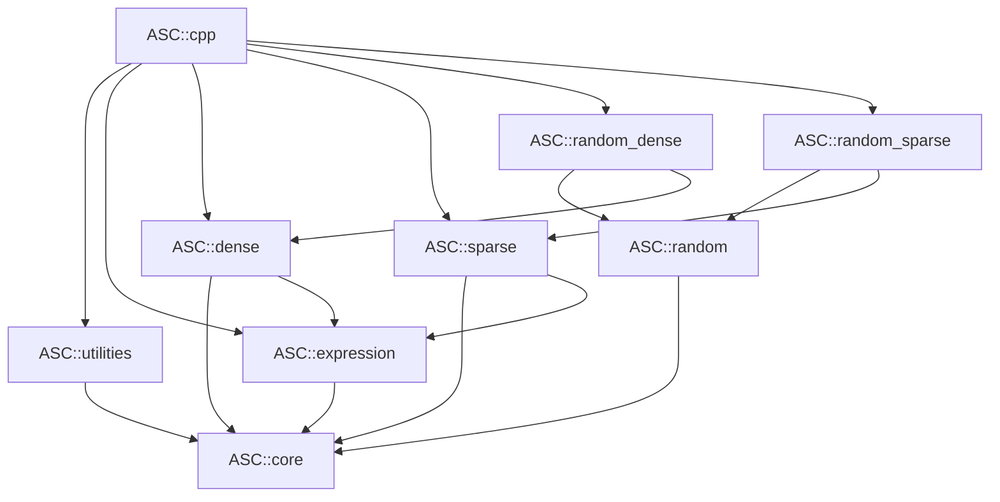

# asc-cpp six-module architecture blueprint

Status: Proposed at Architecture Checkpoint A

Date: 2026-07-26

## 1. Decision summary

asc-cpp will be a C++20, provider-neutral scientific-computing foundation with
exactly six modules:

```text
core, utilities, expression, dense, sparse, random
```

The architecture has no `array`, `linalg`, or shared backend module. Dense and
sparse each own their storage, evaluator, reference kernels, optional CPU
providers, and optional GPU providers. Expression describes computation but
does not own storage or execution. Random owns a core-only base and two
storage-integration facets.

The current repository contains no live implementation. This blueprint
authorizes no production code until the owner approves Checkpoint A.

## 2. Exact dependency and target graph

Build targets and installed aliases:

| Kind | Build target | Installed alias | Direct ASC dependencies |
| --- | --- | --- | --- |
| module | `asc_core` | `ASC::core` | none |
| module | `asc_utilities` | `ASC::utilities` | `ASC::core` |
| module | `asc_expression` | `ASC::expression` | `ASC::core` |
| module | `asc_dense` | `ASC::dense` | `ASC::core`, `ASC::expression` |
| module | `asc_sparse` | `ASC::sparse` | `ASC::core`, `ASC::expression` |
| module | `asc_random` | `ASC::random` | `ASC::core` |
| random-owned facet | `asc_random_dense` | `ASC::random_dense` | `ASC::random`, `ASC::dense` |
| random-owned facet | `asc_random_sparse` | `ASC::random_sparse` | `ASC::random`, `ASC::sparse` |
| convenience aggregate | `asc_cpp` | `ASC::cpp` | all six modules and both random facets |

The facets and aggregate are not additional modules. `ASC::cpp` is never a
dependency of a narrower target and contains no optional provider.



Hard forbidden edges:

```text
utilities -> expression | dense | sparse | random
expression -> utilities | dense | sparse | random
dense      -> utilities | sparse | random
sparse     -> utilities | dense | random
random     -> utilities | expression | dense | sparse
```

## 3. Provider facets

Initial proposed CUDA component names are:

```text
ASC::core_cuda
ASC::dense_cuda
ASC::sparse_cuda
ASC::random_cuda
ASC::random_dense_cuda
ASC::random_sparse_cuda
```

They remain owned by the six modules. CUDA runtime belongs to core; cuBLAS and
cuSOLVER to dense; cuSPARSE to sparse; the approved device generator to random.
No vendor SDK appears in a common module header or an unrequested package
closure.

The serial reference implementation is compiled into each owning base target.
No fake `reference` component is exported. Optimized CPU provider names are
not frozen until their dependency, license, ABI, operation, and CI contracts
are approved.

## 4. Public C++ policy

- Language: strict C++20, extensions disabled.
- Public namespace: flat `namespace asc`.
- Internal namespace names contain `internal`; `asc::detail` is forbidden.
- Public headers: self-contained `.h`, full-path guards, direct includes.
- Compiled C++ sources: `.cc`; CUDA translation units may use `.cu` where the
  toolchain requires it.
- Templates remain in their owning header or deliberately named internal
  headers; no public `-inl.h`/`*_impl.h` convention.
- Current Google C++ Style Guide governs unless an accepted ADR or checked-in
  formatter is more specific.
- Common headers contain no CUDA, OpenMP, Eigen, MKL, BLAS/LAPACK, cuBLAS,
  cuSOLVER, cuSPARSE, cuRAND, SYCL, HIP, or ROCm SDK type.

## 5. Core contract

Core owns only cross-module, storage-independent foundations:

- fixed-width logical index, extent, stride, NNZ, rank, and checked arithmetic;
- shape/extents vocabulary;
- `Status`, `Result<T>`, fatal internal contracts, and provider diagnostics;
- recursive configuration value/schema/provenance;
- byte/text source/sink and portable encoding primitives;
- memory spaces, devices, memory resources, move-only raw buffers;
- explicit copy operations;
- execution context, stream/queue-neutral state, capabilities, and events.

The serial synchronous context is always available. There is no mutable global
device, engine, provider registry, diagnostic stream, or error policy. No
operation silently allocates, transfers, packs, synchronizes, densifies,
changes precision, narrows an index, or falls back.

## 6. Utilities contract

Utilities depends only on core and owns:

- command-line syntax, help, validation, and precedence;
- an approved concrete local-file configuration parser when separately gated;
- transactional merge into the core configuration model;
- timers and small helpers that materially improve on the standard library.

Configuration precedence is:

```text
schema default < local files in command order < command line
               < explicit programmatic override
```

Unknown keys and duplicate scalar keys at one level are errors by default.
Environment and response files are outside v1. Dense/sparse values are never
configuration value alternatives.

## 7. Expression contract

Expression owns non-intrusive C++20 customization, safe node capture, shape and
scalar metadata, operation categories, alias metadata, and sparsity effects.
It depends only on core.

- Scalar terminals are captured by value.
- Lvalue operands use documented non-owning holders.
- Rvalue nodes are owned by value.
- A view captured by value remains non-owning.
- Construction performs no evaluation, allocation, transfer, synchronization,
  or provider selection.
- v1 pointwise compatibility is exact shape plus rank-zero scalar expansion.
  General implicit broadcasting is deferred.
- Dense and sparse implement separate evaluators.
- Algebra operations are descriptors or owning-module APIs, not pointwise
  callable nodes.

## 8. Dense contract

Dense owns:

- move-only dense arrays and const/mutable non-owning views;
- mixed static/dynamic extents with compile-time rank;
- column-major `LayoutLeft` as the named default, row-major `LayoutRight`, and
  explicit non-negative stride mappings;
- slicing, reshape rules, layout/accessor semantics, and alias policy;
- dense expression evaluation and explicit materialization/workspace;
- elementwise operations, reductions, and dense linear algebra;
- serial reference, optional optimized CPU, and optional GPU implementations.

Mutable views require unique mappings. Owner copy is a named clone/copy with an
explicit resource and context. Resize invalidates views. Noncontiguous packing
or temporary materialization is never hidden.

The first dense algebra contract is narrow: copy, scale, axpy, dot, norm,
matrix-vector, matrix-matrix, and selected reductions for float/double.
Factorizations and solvers require later operation/provider ADR additions.

## 9. Sparse contract

Sparse owns:

- general-rank coordinate builders, owners, and views;
- rank-two CSR and CSC owners/views;
- canonicalization, conversions, sparse evaluation, and sparse algebra;
- serial reference, optional optimized CPU, and optional GPU implementations.

Internal indices are zero-based and signed 64-bit by default. Finalization
requires explicit duplicate and explicit-zero policies. Finalized structures
are sorted, unique, validated, and structurally immutable; values may be
mutable. Empty compressed objects have `outer_extent + 1` zero offsets.

Sparsity effects are explicit:

```text
structure-preserving
structure-filtering
structure-union/intersection
value-dependent
densifying
destination-required
```

Sparse evaluation rejects densification. The first algebra capability is a
serial reference CSR SpMV plus structural COO/CSR correctness. No hidden COO
round-trip, dense fallback, or provider-native type leaks into common APIs.

## 10. Dense/sparse interoperability

There is no sibling dependency and no seventh integration module.

- Mixed operations use expression-level readable/writable descriptors.
- The destination storage owner performs evaluation.
- Conversions require a caller-provided destination or builder.
- Result storage is always explicit.
- Densifying work requires an explicit dense destination.
- Dense views can satisfy sparse algorithm operand protocols when both public
  headers are present; sparse does not include or link dense.

## 11. Random contract

Base random depends only on core and owns an explicit, versioned raw-bit engine
contract, scalar distributions/transforms, and state vocabulary. The initial
algorithm is Philox4x32-10, implemented clean-room from approved primary
sources with independently derived vectors. Hidden entropy, default engines,
global pools, and standard-library distribution sequence promises are absent.

Reproducibility is split into raw-bit, distribution, logical-fill, provider,
and serialized-state guarantees. A guarantee is claimed only at its proven
level.

`random_dense` fills caller-provided dense storage in logical-coordinate order.
`random_sparse` separates structure and value streams and initially specifies
exact-count, without-replacement, canonical-coordinate generation. Variable-
consumption distributions require a separate substream design.

ADR 0020 approves a clean-room Joe/Kuo Sobol recurrence and the exact
BSD-style `new-joe-kuo-6.21201` input for Issue 14. The historical MdeCpp
source, tables, binary, converter, and vectors remain blocked. The approved
route requires retained notices, an original deterministic offline generator,
and checked identities; normal builds perform no network or runtime data-file
access.

## 12. Configuration, I/O, and errors

- Public production APIs return `Status` or `Result<T>`; they do not expose
  exceptions.
- Public invalid input is recoverable status; internal impossible invariants
  fail a fatal contract.
- Errors carry a stable ASC code plus optional provider name/native code.
- Diagnostics redact sensitive configuration values and never contain secrets.
- Core I/O specifies ownership, EOF, short read/write, exact read/write,
  overflow, permissions, magic, version, length, and endianness.
- Dense, sparse, and random own their format/state schemas.
- Serialization never causes an implicit device-to-host transfer.
- General logging is not a v1 core responsibility.

## 13. Packaging

Package name is `ASCCpp`; imported namespace is `ASC::`. Components are:

```text
core utilities expression dense sparse random
random_dense random_sparse cpp
```

Provider components are added only when implemented. A no-component lookup is
equivalent to requesting `cpp`. The config validates component names, expands
internal dependencies, discovers only the external dependencies of requested
provider components, includes exports in dependency order, and calls
`check_required_components(ASCCpp)`.

Released asc-cmake v0.1.0 supplies language/warning/sanitizer/test policy.
Standard CMake supplies conditional per-component exports because the released
package helper has one export per package call and no conditional component
abstraction.

## 14. Verification architecture

Every module/facet must have:

- isolated configure/build/install/consume coverage;
- self-contained-header and multi-TU ODR tests;
- direct-target and forbidden-include audits;
- positive and negative compile contracts;
- unit/property/numerical/failure tests;
- allocation/workspace/transfer/synchronization instrumentation;
- sanitizer and concurrency evidence where applicable;
- installed relocated consumers, including paths with spaces.

GPU evidence levels remain separate: configure, compile, real-hardware
runtime, and CPU/reference parity. A skip is not a pass.

## 15. Migration and provenance

MdeCpp at
`f6294e9079262682ce63ae7ff2d8a643e658bf5d`
is a behavior catalogue. Its GPLv3 production/tests are not copied. Clean-room
contracts, independent implementation, and independently derived expectations
are the default. A direct permissive upstream import requires immutable source
identity, license, notice, local-path mapping, modification log, and approval.

Higher MdeCpp domains route to `asc-xde`, `asc-kinetic`, or `asc-lab` as
recorded in `mdecpp-disposition.yaml`.

## 16. Roadmap and approval gate

Implementation follows Milestones 0–8 in `release-roadmap.md`. Milestone 0
creates repository/build/package/test scaffolding and exports no fake component
or production API. The exact files, branch, validation, risks, and rollback are
in `implementation-plan.md`.

Approval of this blueprint means approval of all 18 ADRs, manifests, and the
first-milestone contract. It does not approve optional providers, Sobol, copied
MdeCpp material, publication, or any production implementation beyond the
subsequent explicitly approved milestone.
